Repository: Mir04ange/SOmeShitss
Source: https://github.com/Mir04ange/SOmeShitss
Generated at: 2026-10-01T07:18:36.985Z

---

## Table of Contents

- [Overview and Getting Started](#page-1)
- [Architecture and Component Overview](#page-2)
- [Smart Devices Model and Power Management](#page-3)
- [Streaming Services and Media Control](#page-4)
- [User Interaction, Scenarios, and Workflows](#page-5)
- [Extending the System](#page-6)

---

<a id="page-1"></a>

## Overview and Getting Started

**Related Files**:
- `README.md`
- `src/Main.java`
- `untitled1.iml`
- `.gitignore`

**Related Pages**:
- [Architecture and Component Overview](#page-2)
- [Smart Devices Model and Power Management](#page-3)

<details>
<summary>Relevant source files</summary>

The following files were used as context for generating this wiki page:

- [README.md](https://github.com/Mir04ange/SOmeShitss/blob/main/README.md)
- [src/Main.java](https://github.com/Mir04ange/SOmeShitss/blob/main/src/Main.java)
- [src/DomaciAsistent.java](https://github.com/Mir04ange/SOmeShitss/blob/main/src/DomaciAsistent.java)
- [src/ISmartDevice.java](https://github.com/Mir04ange/SOmeShitss/blob/main/src/ISmartDevice.java)
- [src/ZakladniZarizeni.java](https://github.com/Mir04ange/SOmeShitss/blob/main/src/ZakladniZarizeni.java)
- [src/SmartLight.java](https://github.com/Mir04ange/SOmeShitss/blob/main/src/SmartLight.java)
- [src/SmartThermostat.java](https://github.com/Mir04ange/SOmeShitss/blob/main/src/SmartThermostat.java)
- [src/IStreamingService.java](https://github.com/Mir04ange/SOmeShitss/blob/main/src/IStreamingService.java)
- [src/Netflix.java](https://github.com/Mir04ange/SOmeShitss/blob/main/src/Netflix.java)
- [src/Spotify.java](https://github.com/Mir04ange/SOmeShitss/blob/main/src/Spotify.java)
- [src/YouTube.java](https://github.com/Mir04ange/SOmeShitss/blob/main/src/YouTube.java)
- [src/Scenario.java](https://github.com/Mir04ange/SOmeShitss/blob/main/src/Scenario.java)
</details>

# Overview and Getting Started

This project implements a console-based “Home Assistant” application that manages smart devices (lights and thermostats), integrates with streaming services, tracks usage statistics, and allows users to define executable scenarios (macros) of actions. The system is written in Java and organized around a central `DomaciAsistent` controller that is driven by a text menu in `Main`.  
Sources: [Main.java:1-40](), [DomaciAsistent.java:1-33](), [README.md]()  

The assistant supports adding/removing devices, controlling power state, managing thermostat temperature, enforcing a household power consumption limit, computing optimal “power saving mode” device subsets, interacting with multiple streaming services, and creating reusable scenarios composed of actions on devices and services.  
Sources: [DomaciAsistent.java:35-214](), [DomaciAsistent.java:216-331](), [Scenario.java:1-32]()

---

## High-Level Architecture

The system is structured around a main loop, a controller, domain abstractions for devices and streaming services, and scenario orchestration.

### Component Overview

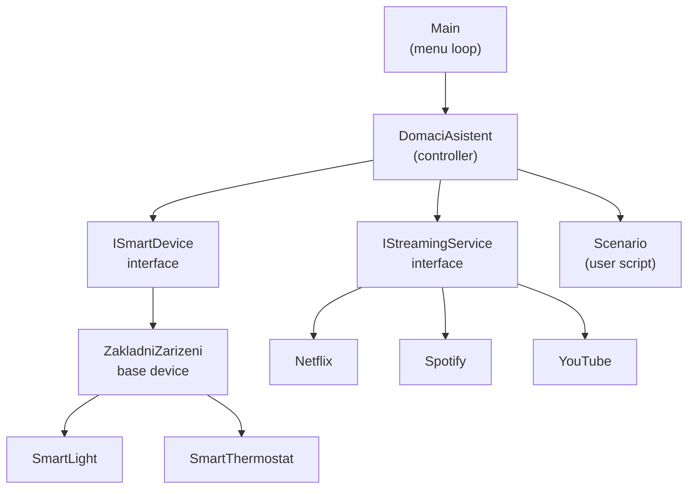

This diagram shows how the `Main` class drives `DomaciAsistent`, which manages both smart devices (`ISmartDevice` hierarchy) and streaming services (`IStreamingService` implementations), and composes them into `Scenario` objects.  
Sources: [Main.java:5-39](), [DomaciAsistent.java:1-33](), [ISmartDevice.java:1-18](), [ZakladniZarizeni.java:1-50](), [SmartLight.java:1-23](), [SmartThermostat.java:1-38](), [IStreamingService.java:1-14](), [Netflix.java:1-27](), [Spotify.java:1-27](), [YouTube.java:1-27](), [Scenario.java:1-32]()

### Key Components Table

| Component          | Type        | Responsibility                                                                          |
|--------------------|------------|-----------------------------------------------------------------------------------------|
| `Main`             | Class      | Entry point; displays menu, reads user input, delegates actions to `DomaciAsistent`.   |
| `DomaciAsistent`   | Class      | Central controller for devices, services, scenarios, statistics, and power management. |
| `ISmartDevice`     | Interface  | Abstraction for smart devices (power state, name, usage count, power, priority).       |
| `ZakladniZarizeni` | Abstract   | Base implementation of `ISmartDevice` with common behavior and validation.             |
| `SmartLight`       | Class      | Smart light implementation with default power and priority.                            |
| `SmartThermostat`  | Class      | Thermostat device with temperature management and custom `zapni` behavior.             |
| `IStreamingService`| Interface  | Abstraction for streaming services (play/stop, running state, usage count, name).      |
| `Netflix`          | Class      | Streaming service implementation.                                                       |
| `Spotify`          | Class      | Streaming service implementation.                                                       |
| `YouTube`          | Class      | Streaming service implementation.                                                       |
| `Scenario`         | Class      | User-defined sequence of actions on devices/services with descriptions.                |

Sources: [Main.java:5-39](), [DomaciAsistent.java:1-33](), [ISmartDevice.java:1-18](), [ZakladniZarizeni.java:1-50](), [SmartLight.java:1-23](), [SmartThermostat.java:1-38](), [IStreamingService.java:1-14](), [Netflix.java:1-27](), [Spotify.java:1-27](), [YouTube.java:1-27](), [Scenario.java:1-32]()

---

## Application Startup and Main Menu

### Program Entry and Loop

The application starts in `Main.main`, which constructs a `Scanner` and a `DomaciAsistent`, then enters an infinite loop that prints a Czech-language menu, reads numeric choices, and dispatches to methods on `DomaciAsistent`.  
Sources: [Main.java:5-39]()

```java
public static void main(String[] args) {
    Scanner scanner = new Scanner(System.in);
    DomaciAsistent a = new DomaciAsistent(scanner);
    while (true) {
        System.out.println("\n--- Domácí Asistent Menu ---");
        System.out.println("*".repeat(80));
        System.out.println(
            "1 Přidat zařízení | 2 Odebrat | 3 Vypsat zařízení | 4 Zapnout všechna | 5 Vypnout všechna"
        );
        // ...
        System.out.print("Vyberte možnost: ");
        int volba = scanner.nextInt();
        scanner.nextLine();
        switch (volba) {
            case 1:  a.pridejZarizeni(); break;
            // ...
            case 8:
                System.out.println("Konec programu.");
                return;
            default:
                System.out.println("Neplatná volba.");
        }
        System.out.println("_".repeat(80));
    }
}
```

Sources: [Main.java:5-39]()

### Menu Flow Diagram

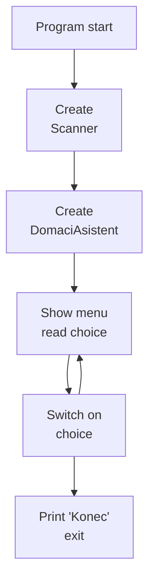

The loop repeatedly shows the menu, reads an integer, and either calls a corresponding method on `DomaciAsistent` or exits on choice `8`.  
Sources: [Main.java:5-39]()

---

## Core Controller: DomaciAsistent

`DomaciAsistent` maintains collections of devices, streaming services, and scenarios, as well as the household power limit and current best combination for power-saving mode.  
Sources: [DomaciAsistent.java:1-33](), [DomaciAsistent.java:216-331]()

### Internal State

- `List<ISmartDevice> zarizeni`: managed smart devices.  
- `List<IStreamingService> sluzby`: available streaming services (`Netflix`, `Spotify`, `YouTube`) instantiated in the constructor.  
- `List<Scenario> scenare`: user-defined scenarios.  
- `Scanner scanner`: shared input reader provided from `Main`.  
- `double maximalniPrikon`: maximum allowed power draw; initialized to `Double.POSITIVE_INFINITY`.  
- `List<ISmartDevice> nejlepsiKombinace`, `int nejlepsiPriorita`, `double nejlepsiKombinacePrikon`: state used by the backtracking algorithm for power-saving mode.  

Sources: [DomaciAsistent.java:1-33](), [DomaciAsistent.java:260-268]()

```java
private final List<ISmartDevice> zarizeni = new ArrayList<>();
private final List<IStreamingService> sluzby = new ArrayList<>();
private final List<Scenario> scenare = new ArrayList<>();
private final Scanner scanner;
private double maximalniPrikon = Double.POSITIVE_INFINITY;

public DomaciAsistent(Scanner scanner) {
    this.scanner = scanner;
    sluzby.add(new Netflix());
    sluzby.add(new Spotify());
    sluzby.add(new YouTube());
}
```

Sources: [DomaciAsistent.java:1-13]()

### High-Level Responsibilities

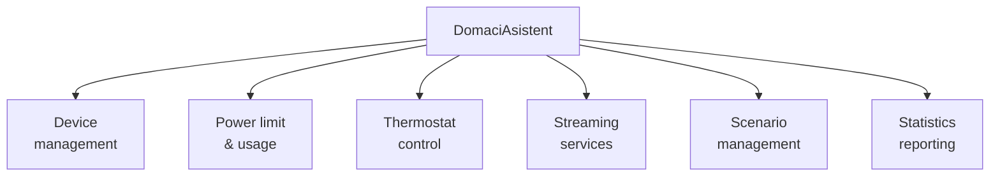

`DomaciAsistent` encapsulates device lifecycle operations, power-level controls, thermostat-specific actions, control of streaming services, scenario creation/execution, and statistics/consumption reporting.  
Sources: [DomaciAsistent.java:35-214](), [DomaciAsistent.java:216-331]()

---

## Smart Devices Subsystem

### ISmartDevice and ZakladniZarizeni

`ISmartDevice` defines the contract for all smart devices, including power operations, state, name, usage count, and optional power/priority.  
Sources: [ISmartDevice.java:1-18]()

```java
public interface ISmartDevice {
    void zapni();
    void vypni();
    String stav();
    String getNazev();
    void setNazev(String nazev);
    int getPocetSpusteni();

    default double getPrikon() {
        return 0;
    }

    default int getPriorita() {
        return 1;
    }
}
```

Sources: [ISmartDevice.java:1-18]()

`ZakladniZarizeni` is an abstract base implementation that holds the name, power state, usage count, power (`prikon`), and priority (`priorita`), with validation logic in the constructor and setter.  
Sources: [ZakladniZarizeni.java:1-50]()

```java
public abstract class ZakladniZarizeni implements ISmartDevice {

    private String nazev;
    private boolean zapnuto;
    private int pocetSpusteni;
    private final double prikon;
    private final int priorita;

    protected ZakladniZarizeni(String nazev, double prikon, int priorita) {
        if (nazev == null || nazev.trim().isEmpty()) throw new IllegalArgumentException("Název nesmí být prázdný.");
        if (prikon < 0) throw new IllegalArgumentException("Příkon nesmí být záporný.");
        if (priorita < 1 || priorita > 10) throw new IllegalArgumentException("Priorita musí být 1 až 10.");
        this.nazev = nazev;
        this.prikon = prikon;
        this.priorita = priorita;
    }

    @Override
    public void zapni() {
        if (!zapnuto) {
            zapnuto = true;
            pocetSpusteni++;
        }
        System.out.println(nazev + " je zapnuto.");
    }

    @Override
    public void vypni() {
        zapnuto = false;
        System.out.println(nazev + " je vypnuto.");
    }

    @Override
    public String stav() {
        return zapnuto ? "zapnuto" : "vypnuto";
    }

    // getters/setters ...
}
```

Sources: [ZakladniZarizeni.java:1-43]()

### Concrete Devices: SmartLight and SmartThermostat

`SmartLight` is a simple extension with default 60W power and priority 5.  
Sources: [SmartLight.java:1-15]()

```java
class SmartLight extends ZakladniZarizeni {

    public SmartLight(String nazev) {
        this(nazev, 60, 5);
    }

    public SmartLight(String nazev, double prikon, int priorita) {
        super(nazev, prikon, priorita);
    }

    @Override
    public String toString() {
        return (
            getNazev() +
            " - " +
            stav() +
            " (" +
            getPrikon() +
            " W, priorita " +
            getPriorita() +
            ", spuštění " +
            getPocetSpusteni() +
            ")"
        );
    }
}
```

Sources: [SmartLight.java:1-23]()

`SmartThermostat` adds a `teplota` (temperature) field and overrides `zapni` to print a different message when already on.  
Sources: [SmartThermostat.java:1-38]()

```java
class SmartThermostat extends ZakladniZarizeni {

    private double teplota;

    public SmartThermostat(String nazev, double teplota) {
        this(nazev, teplota, 1500, 8);
    }

    public SmartThermostat(String nazev, double teplota, double prikon, int priorita) {
        super(nazev, prikon, priorita);
        this.teplota = teplota;
    }

    public void nastavTeplotu(double novaTeplota) {
        this.teplota = novaTeplota;
        System.out.println("Teplota nastavena na " + teplota + "°C.");
    }

    @Override
    public void zapni() {
        if (!isZapnuto()) super.zapni(); else System.out.println(
            getNazev() + " je již zapnutý, teplota nastavena na " + teplota + "°C."
        );
    }

    @Override
    public String toString() {
        return super.toString() + ", teplota " + teplota + "°C";
    }
}
```

Sources: [SmartThermostat.java:1-12](), [SmartThermostat.java:18-38]()

### Device Management Operations

`DomaciAsistent` provides methods to add, remove, rename, list, and power-control devices:

- `pridejZarizeni()`: interactively add `SmartLight` or `SmartThermostat` with user-supplied name, optional power, and priority.  
- `odeberZarizeni()`: remove a device identified by name.  
- `vypisZarizeni()`: list all managed devices.  
- `prepisNazevZarizeni()`: rename a device.  
- `zapniVse()` / `vypniVse()`: turn all devices on or off, applying power-limit checks when turning on.  

Sources: [DomaciAsistent.java:35-89](), [DomaciAsistent.java:91-118]()

```java
public void pridejZarizeni() {
    System.out.println("Vyberte typ zařízení:\n1. SmartLight\n2. SmartThermostat");
    int typ = nactiInt("Typ: ");
    System.out.print("Zadejte název zařízení: ");
    String nazev = scanner.nextLine();
    System.out.print("Zadejte příkon ve wattech (prázdné = výchozí): ");
    String p = scanner.nextLine();
    double prikon = p.trim().isEmpty() ? (typ == 1 ? 60 : 1500) : Double.parseDouble(p);
    int priorita = nactiRozsah("Zadejte prioritu 1–10 (prázdné = 5): ", 5, 1, 10);
    if (typ == 1) zarizeni.add(new SmartLight(nazev, prikon, priorita)); else if (typ == 2) {
        double t = nactiDouble("Zadejte počáteční teplotu: ");
        zarizeni.add(new SmartThermostat(nazev, t, prikon, priorita));
    } else System.out.println("Neplatný typ zařízení.");
}
```

Sources: [DomaciAsistent.java:35-52]()

### Device Interaction Sequence Example

The following sequence diagram shows how choosing “Add device” from the menu flows through the system:

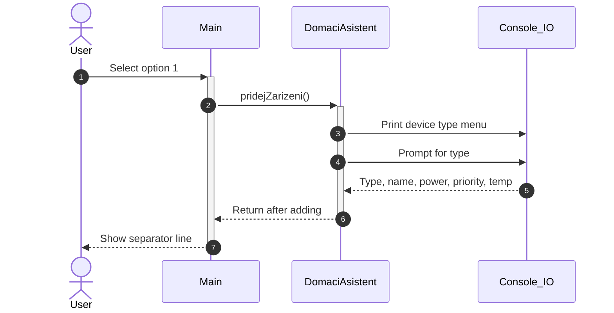

Sources: [Main.java:20-30](), [DomaciAsistent.java:35-52]()

---

## Streaming Services Subsystem

### IStreamingService and Implementations

`IStreamingService` defines operations to play a title, stop playback, query if playing, and provides default implementations of `getNazev()` (class simple name) and `getPocetSpusteni()` (default 0).  
Sources: [IStreamingService.java:1-14]()

```java
public interface IStreamingService {
    void prehrat(String nazevTitulu);
    void stop();
    boolean prehrava();

    default String getNazev() {
        return getClass().getSimpleName();
    }

    default int getPocetSpusteni() {
        return 0;
    }
}
```

Sources: [IStreamingService.java:1-14]()

`Netflix`, `Spotify`, and `YouTube` each implement this interface with a `prehravani` flag and `pocetSpusteni` counter incremented when playback starts from a stopped state.  
Sources: [Netflix.java:1-27](), [Spotify.java:1-27](), [YouTube.java:1-27]()

```java
public class Netflix implements IStreamingService {

    private boolean prehravani;
    private int pocetSpusteni;

    @Override
    public void prehrat(String titul) {
        if (!prehravani) pocetSpusteni++;
        prehravani = true;
        System.out.println("Přehrávání na Netflixu: " + titul);
    }

    @Override
    public void stop() {
        prehravani = false;
        System.out.println("Netflix přehrávání ukončeno.");
    }

    @Override
    public boolean prehrava() {
        return prehravani;
    }

    @Override
    public int getPocetSpusteni() {
        return pocetSpusteni;
    }
}
```

Sources: [Netflix.java:1-27]()

### Service Management in DomaciAsistent

- Services are instantiated once in the constructor: `new Netflix()`, `new Spotify()`, `new YouTube()`.  
- `prehratNaVsechSluzbach()`: prompts user for content title and calls `prehrat` on all services.  
- `vypisAktivni()`: lists services that are currently playing, along with playback counts.  
- `vypisStatistiku()`: computes most-used service using streaming APIs and prints total service starts.  

Sources: [DomaciAsistent.java:7-13](), [DomaciAsistent.java:120-131](), [DomaciAsistent.java:146-164]()

```java
public void prehratNaVsechSluzbach() {
    System.out.print("Zadejte název obsahu: ");
    String titul = scanner.nextLine();
    for (IStreamingService s : sluzby) s.prehrat(titul);
}
```

Sources: [DomaciAsistent.java:120-125]()

---

## Power Management and Consumption

### Power Limit Configuration

`nastavLimitPrikonu()` allows the user to set the maximum allowed household power in watts. The value is stored in `maximalniPrikon`.  
Sources: [DomaciAsistent.java:175-181]()

```java
public void nastavLimitPrikonu() {
    maximalniPrikon = nactiDouble("Maximální povolený příkon domácnosti ve wattech: ");
    System.out.println("Limit nastaven na " + maximalniPrikon + " W.");
}
```

Sources: [DomaciAsistent.java:175-181]()

### Enforced Limit When Turning On Devices

All device activation flows through a private `zapni(ISmartDevice z)` method, which checks if the device is already on and whether turning it on would exceed `maximalniPrikon` based on the sum of `getPrikon()` for currently on devices.  
Sources: [DomaciAsistent.java:91-118](), [DomaciAsistent.java:191-194]()

```java
private void zapni(ISmartDevice z) {
    if (z.stav().equals("zapnuto")) {
        System.out.println(z.getNazev() + " je již zapnuto.");
        return;
    }
    if (aktualniPrikon() + z.getPrikon() > maximalniPrikon) {
        System.out.println(
            "Upozornění: zařízení " + z.getNazev() + " nelze zapnout, překročil by se limit příkonu."
        );
        return;
    }
    z.zapni();
}
```

Sources: [DomaciAsistent.java:95-107]()

`aktualniPrikon()` computes the current power draw for all devices whose `stav()` is `"zapnuto"`.  
Sources: [DomaciAsistent.java:191-194]()

```java
private double aktualniPrikon() {
    return zarizeni.stream().filter(z -> z.stav().equals("zapnuto")).mapToDouble(ISmartDevice::getPrikon).sum();
}
```

Sources: [DomaciAsistent.java:191-194]()

### Consumption Reporting

`vypisSpotrebu()` prints current consumption, remaining reserve (if a finite limit is set), and the device with the highest power consumption.  
Sources: [DomaciAsistent.java:183-190](), [DomaciAsistent.java:191-194]()

```java
public void vypisSpotrebu() {
    double aktualni = aktualniPrikon();
    double rezerva = Double.isInfinite(maximalniPrikon) ? 0 : Math.max(0, maximalniPrikon - aktualni);
    System.out.println(
        "Aktuální spotřeba: " +
        aktualni +
        " W\nZbývající rezerva: " +
        (Double.isInfinite(maximalniPrikon) ? "neomezená" : rezerva + " W")
    );
    ISmartDevice max = zarizeni.stream().max(Comparator.comparingDouble(ISmartDevice::getPrikon)).orElse(null);
    System.out.println(
        "Největší příkon má: " + (max == null ? "žádné zařízení" : max.getNazev() + " (" + max.getPrikon() + " W)")
    );
}
```

Sources: [DomaciAsistent.java:183-190]()

### Power-Saving Mode Algorithm

`uspornyRezim()` calculates an optimal subset of currently-on devices to keep enabled under `maximalniPrikon`, maximizing the sum of their priorities and minimizing total power in case of ties, using a backtracking search implemented in `hledejKombinaci`.  
Sources: [DomaciAsistent.java:196-214](), [DomaciAsistent.java:216-239]()

```java
public void uspornyRezim() {
    List<ISmartDevice> zapnuta = new ArrayList<>();
    for (ISmartDevice z : zarizeni) if (z.stav().equals("zapnuto")) zapnuta.add(z);
    nejlepsiKombinace = new ArrayList<>();
    nejlepsiPriorita = -1;
    nejlepsiKombinacePrikon = Double.POSITIVE_INFINITY;
    hledejKombinaci(zapnuta, 0, new ArrayList<ISmartDevice>(), 0, 0);
    for (ISmartDevice z : zapnuta) if (!nejlepsiKombinace.contains(z)) z.vypni();
    double suma = nejlepsiKombinace.stream().mapToDouble(ISmartDevice::getPrikon).sum();
    System.out.println(
        "Úsporný režim ponechal zapnuto " + nejlepsiKombinace.size() + " zařízení (" + suma + " W)."
    );
}
```

Sources: [DomaciAsistent.java:196-214]()

```java
private void hledejKombinaci(
    List<ISmartDevice> kandidati,
    int index,
    List<ISmartDevice> vybrana,
    int priorita,
    double prikon
) {
    if (prikon > maximalniPrikon) return;
    if (index == kandidati.size()) {
        if (priorita > nejlepsiPriorita || (priorita == nejlepsiPriorita && prikon < nejlepsiKombinacePrikon)) {
            nejlepsiPriorita = priorita;
            nejlepsiKombinacePrikon = prikon;
            nejlepsiKombinace = new ArrayList<>(vybrana);
        }
        return;
    }
    hledejKombinaci(kandidati, index + 1, vybrana, priorita, prikon);
    ISmartDevice z = kandidati.get(index);
    vybrana.add(z);
    hledejKombinaci(kandidati, index + 1, vybrana, priorita + z.getPriorita(), prikon + z.getPrikon());
    vybrana.remove(vybrana.size() - 1);
}
```

Sources: [DomaciAsistent.java:216-239]()

#### Backtracking Flow Diagram

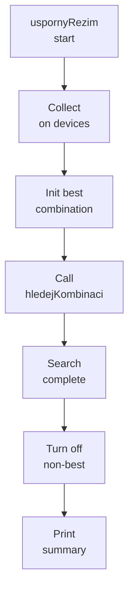

This outlines how `uspornyRezim` gathers currently-on devices, initializes tracking state, runs the recursive search, then turns off devices not in the best combination and reports the outcome.  
Sources: [DomaciAsistent.java:196-214](), [DomaciAsistent.java:216-239]()

---

## Thermostat Control

`ovladaniTermostatu()` lists thermostats, prompts the user for a thermostat name, and if found, asks for a new temperature and calls `nastavTeplotu()` on the corresponding `SmartThermostat`.  
Sources: [DomaciAsistent.java:133-144](), [SmartThermostat.java:18-26]()

```java
public void ovladaniTermostatu() {
    System.out.println("Seznam termostatů:");
    boolean nalezen = false;
    for (ISmartDevice z : zarizeni) {
        if (z instanceof SmartThermostat) {
            System.out.println(z);
            nalezen = true;
        }
    }
    if (!nalezen) {
        System.out.println("(žádné termostaty)");
        return;
    }
    System.out.print("Zadejte název termostatu: ");
    String n = scanner.nextLine();
    for (ISmartDevice z : zarizeni) {
        if (z instanceof SmartThermostat && z.getNazev().equalsIgnoreCase(n)) {
            ((SmartThermostat) z).nastavTeplotu(nactiDouble("Nová teplota: "));
            return;
        }
    }
    System.out.println("Termostat nebyl nalezen.");
}
```

Sources: [DomaciAsistent.java:133-144]()

---

## Scenarios (User Scripts)

### Scenario Model

`Scenario` encapsulates a named list of actions (`Runnable` instances) with human-readable descriptions.  
Sources: [Scenario.java:1-32]()

```java
class Scenario {

    private final String nazev;
    private final List<Runnable> akce = new ArrayList<>();
    private final List<String> popisy = new ArrayList<>();

    Scenario(String nazev) {
        this.nazev = nazev;
    }

    String getNazev() {
        return nazev;
    }

    void pridejAkci(String popis, Runnable runnable) {
        popisy.add(popis);
        akce.add(runnable);
    }

    void vypis() {
        System.out.println("- " + nazev);
        for (String popis : popisy) System.out.println("    " + popis);
    }

    void spust() {
        System.out.println("Spouštím scénář: " + nazev);
        for (Runnable runnable : akce) runnable.run();
    }
}
```

Sources: [Scenario.java:1-32]()

### Scenario Lifecycle in DomaciAsistent

- `vytvorScenar()`:  
  - Prompts for scenario name.  
  - Enters a loop where the user chooses actions:  
    - `1`/`2`: add “Turn on/Turn off device” actions via `zapni(z)` or `z::vypni`.  
    - `3`/`4`: add “Play/Stop service” actions using `sl.prehrat(t)` or `sl::stop`.  
  - Ends when the user selects `0` and stores the scenario.  

- `vypisScenare()`: lists all scenarios using `Scenario.vypis()`.  
- `spustScenar()`: finds a scenario by name and calls `spust()`.  
- `odstranScenar()`: removes a scenario by name.  

Sources: [DomaciAsistent.java:241-259](), [DomaciAsistent.java:268-289]()

```java
public void vytvorScenar() {
    System.out.print("Název scénáře: ");
    Scenario s = new Scenario(scanner.nextLine());
    while (true) {
        System.out.println("1 Zapnout zařízení, 2 Vypnout zařízení, 3 Přehrát službu, 4 Zastavit službu, 0 Hotovo");
        int volba = nactiInt("Akce: ");
        if (volba == 0) break;
        if (volba == 1 || volba == 2) {
            ISmartDevice z = najdiZarizeni("zařízení pro akci");
            if (z != null) {
                if (volba == 1) s.pridejAkci("Zapnout " + z.getNazev(), () -> zapni(z)); else s.pridejAkci(
                    "Vypnout " + z.getNazev(),
                    z::vypni
                );
            }
        } else if (volba == 3 || volba == 4) {
            IStreamingService sl = najdiSluzbu();
            if (sl != null) {
                if (volba == 3) {
                    System.out.print("Titul: ");
                    String t = scanner.nextLine();
                    s.pridejAkci("Přehrát " + sl.getNazev(), () -> sl.prehrat(t));
                } else s.pridejAkci("Zastavit " + sl.getNazev(), sl::stop);
            }
        }
    }
    scenare.add(s);
}
```

Sources: [DomaciAsistent.java:241-259]()

### Scenario Flow Diagram

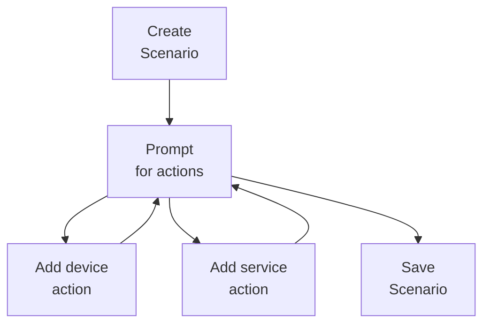

This shows the loop where multiple actions can be appended to a scenario before it is stored.  
Sources: [DomaciAsistent.java:241-259](), [Scenario.java:13-22]()

---

## Statistics and Monitoring

### Active Devices and Services

`vypisAktivni()` prints:

- “Zapnutá zařízení:” and each device whose `stav()` is `"zapnuto"`.  
- “Spuštěné služby:” and each service where `prehrava()` is `true`, including playback counts.  

Sources: [DomaciAsistent.java:146-154]()

```java
public void vypisAktivni() {
    System.out.println("Zapnutá zařízení:");
    for (ISmartDevice z : zarizeni) if (z.stav().equals("zapnuto")) System.out.println(z);
    System.out.println("Spuštěné služby:");
    for (IStreamingService s : sluzby) if (s.prehrava()) System.out.println(
        s.getNazev() + " (spuštění " + s.getPocetSpusteni() + ")"
    );
}
```

Sources: [DomaciAsistent.java:146-154]()

### Usage Statistics

`vypisStatistiku()` uses streams to compute:

- The most frequently started device (by `getPocetSpusteni`).  
- The most frequently started streaming service.  
- The total number of device starts and service starts.  

Sources: [DomaciAsistent.java:156-174]()

```java
public void vypisStatistiku() {
    ISmartDevice zdroj = zarizeni
        .stream()
        .max(Comparator.comparingInt(ISmartDevice::getPocetSpusteni))
        .orElse(null);
    IStreamingService sluzba = sluzby
        .stream()
        .max(Comparator.comparingInt(IStreamingService::getPocetSpusteni))
        .orElse(null);
    int soucetZ = zarizeni.stream().mapToInt(ISmartDevice::getPocetSpusteni).sum();
    int soucetS = sluzby.stream().mapToInt(IStreamingService::getPocetSpusteni).sum();
    System.out.println(
        "Statistika:\nNejpoužívanější zařízení: " +
        (zdroj == null ? "žádné" : zdroj.getNazev() + " (" + zdroj.getPocetSpusteni() + ")")
    );
    System.out.println(
        "Nejpoužívanější služba: " +
        (sluzba == null ? "žádná" : sluzba.getNazev() + " (" + sluzba.getPocetSpusteni() + ")")
    );
    System.out.println("Součet spuštění všech zařízení: " + soucetZ);
    System.out.println("Součet spuštění všech služeb: " + soucetS);
}
```

Sources: [DomaciAsistent.java:156-174]()

---

## Getting Started: Typical Usage Path

Although no explicit “getting started” instructions are in the README, the combination of `Main` and `DomaciAsistent` defines an implicit onboarding path:  
Sources: [README.md](), [Main.java:5-39](), [DomaciAsistent.java:35-52]()

### Step-by-Step Console Workflow

1. **Run the application** to enter the main menu (from `Main.main`).  
2. **Add devices (option 1)** using `pridejZarizeni()`, choosing device type, name, power, and priority.  
3. **Optionally set power limit (option 12)** with `nastavLimitPrikonu()`.  
4. **Turn on devices (option 4)** and verify active status via `vypisAktivni()` (option 9).  
5. **Control the thermostat (option 7)** to view and adjust thermostat temperatures.  
6. **Play media (option 6)** to broadcast a title to all streaming services.  
7. **Create scenarios (option 15)** and later **list** (16), **run** (17), or **delete** (18) them.  
8. **Review statistics (option 11)** or **current consumption (option 13)**.  
9. **Trigger power-saving mode (option 14)** to automatically keep the best subset of devices on below the limit.  

Sources: [Main.java:14-38](), [DomaciAsistent.java:35-52](), [DomaciAsistent.java:120-125](), [DomaciAsistent.java:133-144](), [DomaciAsistent.java:175-214](), [DomaciAsistent.java:241-259]()

---

## Summary

This “Home Assistant” project provides a console interface for managing smart devices and streaming services, with an extensible architecture based on `ISmartDevice` and `IStreamingService` abstractions and shared behavior in `ZakladniZarizeni`. `DomaciAsistent` centralizes operations like adding/removing devices, enforcing a configurable power limit, computing an optimal subset of active devices, controlling thermostats, orchestrating streaming playback, and executing reusable scenarios composed of device/service actions. The `Main` class exposes these capabilities via a structured text menu, enabling users to incrementally explore and manage the system’s functionality.  
Sources: [Main.java:5-39](), [DomaciAsistent.java:1-33](), [DomaciAsistent.java:35-214](), [ISmartDevice.java:1-18](), [IStreamingService.java:1-14](), [ZakladniZarizeni.java:1-50](), [Scenario.java:1-32]()

---

<a id="page-2"></a>

## Architecture and Component Overview

**Related Files**:
- `src/Main.java`
- `src/DomaciAsistent.java`
- `src/ISmartDevice.java`
- `src/IStreamingService.java`
- `src/Scenario.java`

**Related Pages**:
- [Overview and Getting Started](#page-1)
- [Smart Devices Model and Power Management](#page-3)
- [Streaming Services and Media Control](#page-4)

<details>
<summary>Relevant source files</summary>

The following files were used as context for generating this wiki page:

- [src/Main.java](https://github.com/Mir04ange/SOmeShitss/blob/main/src/Main.java)
- [src/DomaciAsistent.java](https://github.com/Mir04ange/SOmeShitss/blob/main/src/DomaciAsistent.java)
- [src/ISmartDevice.java](https://github.com/Mir04ange/SOmeShitss/blob/main/src/ISmartDevice.java)
- [src/IStreamingService.java](https://github.com/Mir04ange/SOmeShitss/blob/main/src/IStreamingService.java)
- [src/Scenario.java](https://github.com/Mir04ange/SOmeShitss/blob/main/src/Scenario.java)
- [src/ZakladniZarizeni.java](https://github.com/Mir04ange/SOmeShitss/blob/main/src/ZakladniZarizeni.java)
- [src/SmartLight.java](https://github.com/Mir04ange/SOmeShitss/blob/main/src/SmartLight.java)
- [src/SmartThermostat.java](https://github.com/Mir04ange/SOmeShitss/blob/main/src/SmartThermostat.java)
- [src/Netflix.java](https://github.com/Mir04ange/SOmeShitss/blob/main/src/Netflix.java)
- [src/Spotify.java](https://github.com/Mir04ange/SOmeShitss/blob/main/src/Spotify.java)
- [src/YouTube.java](https://github.com/Mir04ange/SOmeShitss/blob/main/src/YouTube.java)
</details>

# Architecture and Component Overview

## Introduction

This project implements a console-based “Home Assistant” that manages smart devices (lights and thermostats) and streaming services (Netflix, Spotify, YouTube). The assistant provides a text menu interface to add, remove, and control devices; manage streaming playback; enforce a household power limit; compute statistics; and define reusable scenarios composed of actions.  
Sources: [Main.java:5-43](), [DomaciAsistent.java:7-24](), [SmartLight.java:3-18](), [SmartThermostat.java:3-21](), [Netflix.java:3-23](), [Spotify.java:3-23](), [YouTube.java:3-23]()

The architecture is centered around the `DomaciAsistent` orchestration class, which coordinates `ISmartDevice` implementations and `IStreamingService` implementations. The `Main` class provides the CLI loop, and `Scenario` encapsulates named sequences of actions runnable on demand. Common behavior for smart devices is abstracted in `ZakladniZarizeni`, with concrete devices extending it.  
Sources: [DomaciAsistent.java:7-18](), [Main.java:7-26](), [Scenario.java:5-29](), [ZakladniZarizeni.java:3-48]()

---

## High-Level Architecture

### Component Responsibilities

| Component           | Type         | Responsibility                                                                                     |
|---------------------|-------------|----------------------------------------------------------------------------------------------------|
| `Main`              | CLI entry   | Starts the application, owns the main menu loop, delegates commands to `DomaciAsistent`.          |
| `DomaciAsistent`    | Orchestrator| Manages device/services collections, power limit, statistics, and scenarios; exposes operations.  |
| `ISmartDevice`      | Interface   | Abstraction for all smart devices (basic control + metrics).                                      |
| `ZakladniZarizeni`  | Abstract    | Shared implementation of `ISmartDevice` (name, state, power, priority, run counts).              |
| `SmartLight`        | Device      | Concrete light with default and customizable power/priority.                                      |
| `SmartThermostat`   | Device      | Thermostat with temperature management and custom `zapni` behavior.                              |
| `IStreamingService` | Interface   | Abstraction for streaming services (play, stop, state, name).                                    |
| `Netflix`           | Service     | Streaming service implementation.                                                                 |
| `Spotify`           | Service     | Streaming service implementation.                                                                 |
| `YouTube`           | Service     | Streaming service implementation.                                                                 |
| `Scenario`          | Utility     | Named list of actions (Runnables) that can be printed and executed sequentially.                 |

Sources: [Main.java:7-43](), [DomaciAsistent.java:7-24](), [ISmartDevice.java:3-18](), [IStreamingService.java:3-15](), [ZakladniZarizeni.java:3-48](), [SmartLight.java:3-18](), [SmartThermostat.java:3-32](), [Netflix.java:3-23](), [Spotify.java:3-23](), [YouTube.java:3-23](), [Scenario.java:5-29]()

### Top-Level Component Diagram

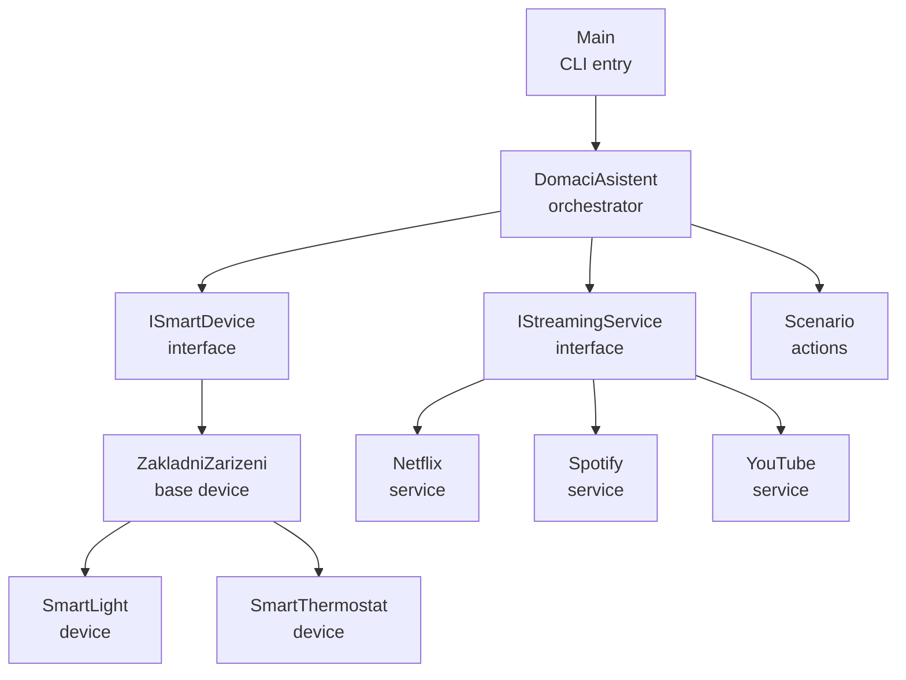

Sources: [Main.java:7-43](), [DomaciAsistent.java:7-24](), [ISmartDevice.java:3-18](), [ZakladniZarizeni.java:3-48](), [SmartLight.java:3-18](), [SmartThermostat.java:3-32](), [IStreamingService.java:3-15](), [Netflix.java:3-23](), [Spotify.java:3-23](), [YouTube.java:3-23](), [Scenario.java:5-29]()

---

## Entry Point and Menu Flow

### `Main` Class

`Main` is the entry point. It constructs a `Scanner`, creates a `DomaciAsistent` instance, and enters an infinite loop displaying a menu and dispatching user selections to assistant methods. The loop terminates when the user selects option `8`.  
Sources: [Main.java:7-43]()

Key behavior:

- Creates shared input scanner: `Scanner scanner = new Scanner(System.in);`  
- Constructs assistant: `DomaciAsistent a = new DomaciAsistent(scanner);`  
- Repeatedly prints a formatted menu and reads an integer `volba`.  
- Uses a `switch` to map menu options to methods on `DomaciAsistent`.  
Sources: [Main.java:7-43]()

### Menu Option to Assistant Method Mapping

| Menu Option | Description                                   | Assistant Method                   |
|-------------|-----------------------------------------------|------------------------------------|
| 1           | Add device                                    | `pridejZarizeni()`                 |
| 2           | Remove device                                 | `odeberZarizeni()`                 |
| 3           | List devices                                  | `vypisZarizeni()`                  |
| 4           | Turn on all devices                           | `zapniVse()`                       |
| 5           | Turn off all devices                          | `vypniVse()`                       |
| 6           | Play content on all services                  | `prehratNaVsechSluzbach()`         |
| 7           | Thermostat control                            | `ovladaniTermostatu()`             |
| 8           | Exit program                                  | (prints and `return`)              |
| 9           | List active devices and services              | `vypisAktivni()`                   |
| 10          | Rename device                                 | `prepisNazevZarizeni()`            |
| 11          | Statistics                                    | `vypisStatistiku()`                |
| 12          | Set power limit                               | `nastavLimitPrikonu()`             |
| 13          | Show current consumption and reserve          | `vypisSpotrebu()`                  |
| 14          | Power-saving mode                             | `uspornyRezim()`                   |
| 15          | Create scenario                               | `vytvorScenar()`                   |
| 16          | List scenarios                                | `vypisScenare()`                   |
| 17          | Run scenario                                  | `spustScenar()`                    |
| 18          | Remove scenario                               | `odstranScenar()`                  |

Sources: [Main.java:13-43]()

### Menu Flow Diagram

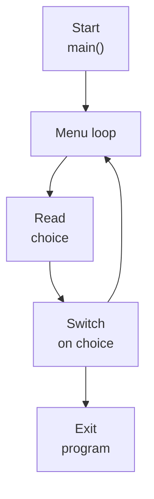

This diagram summarizes the repeated menu-then-dispatch behavior until the exit option is chosen.  
Sources: [Main.java:7-43]()

---

## Core Orchestrator: `DomaciAsistent`

### Internal State and Collections

`DomaciAsistent` maintains collections of devices, streaming services, and scenarios, plus a shared scanner and a configurable power limit.  
Sources: [DomaciAsistent.java:7-24](), [DomaciAsistent.java:137-151]()

Key fields:

- `private final List<ISmartDevice> zarizeni = new ArrayList<>();`  
- `private final List<IStreamingService> sluzby = new ArrayList<>();`  
- `private final List<Scenario> scenare = new ArrayList<>();`  
- `private final Scanner scanner;`  
- `private double maximalniPrikon = Double.POSITIVE_INFINITY;`  
- Fields for power-saving search: `nejlepsiKombinace`, `nejlepsiPriorita`, `nejlepsiKombinacePrikon`.  
Sources: [DomaciAsistent.java:7-24](), [DomaciAsistent.java:137-151]()

In the constructor, three streaming services are registered by default: `Netflix`, `Spotify`, `YouTube`.  
Sources: [DomaciAsistent.java:18-24]()

```java
public DomaciAsistent(Scanner scanner) {
	this.scanner = scanner;
	sluzby.add(new Netflix());
	sluzby.add(new Spotify());
	sluzby.add(new YouTube());
}
```

Sources: [DomaciAsistent.java:18-24]()

### High-Level Responsibility Diagram

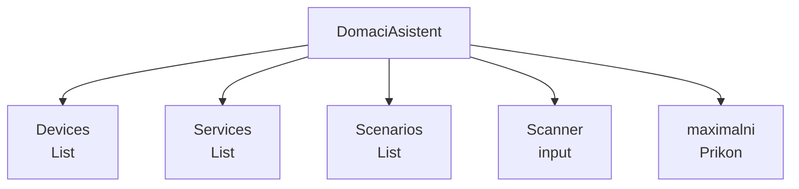

Sources: [DomaciAsistent.java:7-24]()

---

## Smart Devices Architecture

### `ISmartDevice` Interface

`ISmartDevice` defines the minimal contract for smart devices:

```java
public interface ISmartDevice {
	void zapni();
	void vypni();
	String stav();
	String getNazev();
	void setNazev(String nazev);
	int getPocetSpusteni();

	default double getPrikon() {
		return 0;
	}

	default int getPriorita() {
		return 1;
	}
}
```

Sources: [ISmartDevice.java:3-18]()

Semantics:

- `zapni()` / `vypni()` control power state.  
- `stav()` returns `"zapnuto"` or `"vypnuto"` according to implementing classes.  
- `getNazev()` / `setNazev()` manage human-readable device name.  
- `getPocetSpusteni()` tracks how many times a device was switched on.  
- `getPrikon()` (default `0`) and `getPriorita()` (default `1`) support power-aware and priority-based logic in `DomaciAsistent`.  

Sources: [ISmartDevice.java:3-18]()

### Common Implementation: `ZakladniZarizeni`

`ZakladniZarizeni` provides a shared implementation of `ISmartDevice` with validation and standard state management.  
Sources: [ZakladniZarizeni.java:3-48]()

Key behavior:

- Validates constructor arguments: non-empty name, non-negative power, priority in range 1–10.  
- Maintains:
  - `nazev` (String)  
  - `zapnuto` (boolean)  
  - `pocetSpusteni` (int)  
  - `prikon` (double, final)  
  - `priorita` (int, final)  
- `zapni()`:
  - If not already `zapnuto`, sets `zapnuto = true` and increments `pocetSpusteni`.  
  - Prints `"<nazev> je zapnuto."`.  
- `vypni()`:
  - Sets `zapnuto = false`.  
  - Prints `"<nazev> je vypnuto."`.  
- `stav()` returns `"zapnuto"` if `zapnuto` is true, otherwise `"vypnuto"`.  
- Provides non-default implementations for `getPrikon()` and `getPriorita()`.  

Sources: [ZakladniZarizeni.java:3-48]()

`ZakladniZarizeni` also exposes `isZapnuto()` and `setZapnuto()` for subclasses, and overrides `toString()` with a summary including state, power, priority, and run count.  
Sources: [ZakladniZarizeni.java:34-48]()

### Concrete Devices

#### `SmartLight`

`SmartLight` is a simple light device that inherits the default behavior from `ZakladniZarizeni`.  
Sources: [SmartLight.java:3-18]()

- Default constructor uses `60` W and priority `5`.  
- Full constructor accepts custom `nazev`, `prikon`, and `priorita`.  
- Overrides `toString()` to format:  
  `"<nazev> - <stav> (<prikon> W, priorita <priorita>, spuštění <pocetSpusteni>)"`.  

Sources: [SmartLight.java:3-18](), [ZakladniZarizeni.java:34-48]()

#### `SmartThermostat`

`SmartThermostat` extends `ZakladniZarizeni` and adds temperature management plus slightly different `zapni()` behavior.  
Sources: [SmartThermostat.java:3-32]()

- Maintains a `double teplota`.  
- Default constructor sets power `1500` W and priority `8`.  
- `nastavTeplotu(double)` updates `teplota` and prints `"Teplota nastavena na <teplota>°C."`.  
- Overrides `zapni()`:
  - If not already on (`!isZapnuto()`), delegates to `super.zapni()`.  
  - Otherwise prints `"<nazev> je již zapnutý, teplota nastavena na <teplota>°C."`.  
- Overrides `toString()` to append `", teplota <teplota>°C"` to base string.  

Sources: [SmartThermostat.java:3-32](), [ZakladniZarizeni.java:34-48]()

### Device Class Diagram

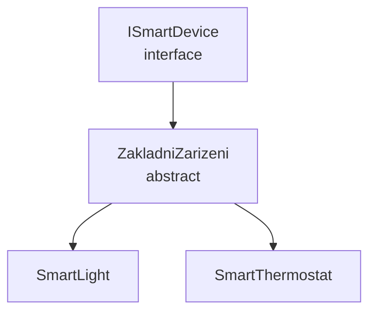

Sources: [ISmartDevice.java:3-18](), [ZakladniZarizeni.java:3-48](), [SmartLight.java:3-18](), [SmartThermostat.java:3-32]()

---

## Streaming Services Architecture

### `IStreamingService` Interface

```java
public interface IStreamingService {
	void prehrat(String nazevTitulu);
	void stop();
	boolean prehrava();

	default String getNazev() {
		return getClass().getSimpleName();
	}

	default int getPocetSpusteni() {
		return 0;
	}
}
```

Sources: [IStreamingService.java:3-15]()

Semantics:

- `prehrat(String nazevTitulu)` starts playback of a title.  
- `stop()` ends playback.  
- `prehrava()` indicates whether the service is currently playing.  
- `getNazev()` defaults to class simple name (e.g., `"Netflix"`).  
- `getPocetSpusteni()` default `0`, overridden by implementations that track run count.  

Sources: [IStreamingService.java:3-15]()

### Concrete Streaming Services

All three services share a similar pattern:

- `boolean prehravani;`  
- `int pocetSpusteni;`  
- `prehrat(String)`:
  - If not currently playing, increments `pocetSpusteni`.  
  - Sets `prehravani = true`.  
  - Prints a message prefixing the service name.  
- `stop()`:
  - Sets `prehravani = false`.  
  - Prints a stop message.  
- `prehrava()` returns `prehravani`.  
- `getPocetSpusteni()` returns `pocetSpusteni`.  

Sources: [Netflix.java:3-23](), [Spotify.java:3-23](), [YouTube.java:3-23]()

### Services Diagram

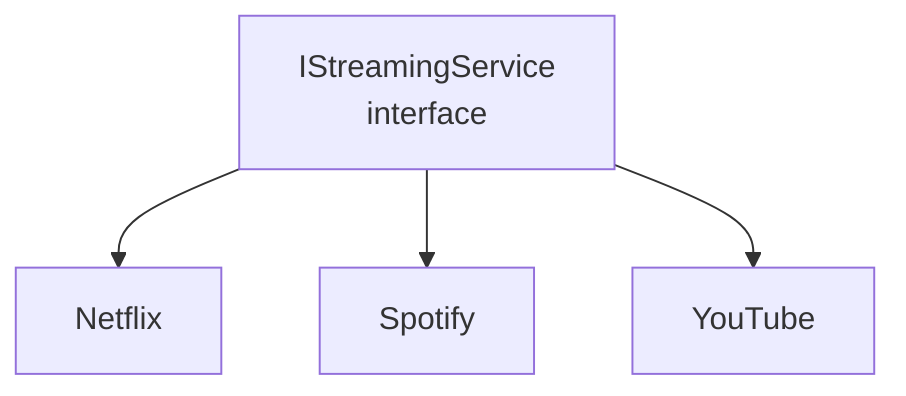

Sources: [IStreamingService.java:3-15](), [Netflix.java:3-23](), [Spotify.java:3-23](), [YouTube.java:3-23]()

---

## Device and Service Management in `DomaciAsistent`

### Adding and Removing Devices

`pridejZarizeni()` interacts with the user to create either a `SmartLight` or `SmartThermostat`, with optional custom power and priority.  
Sources: [DomaciAsistent.java:26-49]()

Flow:

1. Prints type menu: `SmartLight` (1) or `SmartThermostat` (2).  
2. Reads `typ` using `nactiInt`.  
3. Asks for device name and optional power.  
4. Parses power, falling back to `60` W for lights and `1500` W for thermostats if left empty.  
5. Reads priority via `nactiRozsah` (default `5`, bounded 1–10).  
6. For type 1: creates `new SmartLight(...)` and adds to `zarizeni`.  
7. For type 2: asks for initial temperature and creates `new SmartThermostat(...)`.  

`odeberZarizeni()` finds a device by name and removes it from the list.  
Sources: [DomaciAsistent.java:51-60](), [DomaciAsistent.java:186-196]()

### Device Lookup and Listing

- `vypisZarizeni()` prints all managed devices or a placeholder if none.  
- `najdiZarizeni(String prompt)`:
  - Calls `vypisZarizeni()`.  
  - Asks user for a name.  
  - Searches `zarizeni` by case-insensitive name.  
  - Returns the matching device or `null` if not found.  

Sources: [DomaciAsistent.java:62-70](), [DomaciAsistent.java:186-196]()

### Turning Devices On/Off

- `zapniVse()` iterates over all devices and calls a private `zapni(ISmartDevice)` helper.  
- `vypniVse()` iterates over devices and calls `vypni()`.  
- `zapniJedno(ISmartDevice)` is a trivial wrapper around `zapni(z)`.  
Sources: [DomaciAsistent.java:72-84]()

The internal `zapni(ISmartDevice z)` enforces both current state and power limit:

1. If `z.stav().equals("zapnuto")`, prints a message and returns.  
2. Computes `aktualniPrikon() + z.getPrikon()` and compares to `maximalniPrikon`.  
3. If exceeding the limit, prints a warning and does not start the device.  
4. Otherwise, calls `z.zapni()`.  

Sources: [DomaciAsistent.java:86-102](), [DomaciAsistent.java:153-155]()

### Streaming Services Control

- `prehratNaVsechSluzbach()`:
  - Asks user for content title.  
  - Invokes `prehrat(titul)` on each streaming service in `sluzby`.  

Sources: [DomaciAsistent.java:104-110]()

- `najdiSluzbu()`:
  - Lists available services using `s.getNazev()`.  
  - Prompts for service name.  
  - Returns matching service or prints an error and returns `null`.  

Sources: [DomaciAsistent.java:198-208]()

### Thermostat Control

`ovladaniTermostatu()` provides targeted control for thermostats:

1. Iterates `zarizeni`, prints only those that are `instanceof SmartThermostat`.  
2. If none exist, prints placeholder and returns.  
3. Prompts for thermostat name.  
4. Searches again and, when a `SmartThermostat` with matching name is found, calls `nastavTeplotu(...)` with user input.  

Sources: [DomaciAsistent.java:112-133]()

---

## Power Management and Consumption

### Power Limit Configuration

`nastavLimitPrikonu()` sets the maximum allowed household power draw:

- Reads a double via `nactiDouble("Maximální povolený příkon domácnosti ve wattech: ")`.  
- Assigns it to `maximalniPrikon`.  
- Prints confirmation including the new value.  

Sources: [DomaciAsistent.java:151-157]()

If not set explicitly, `maximalniPrikon` starts as `Double.POSITIVE_INFINITY`, effectively no limit.  
Sources: [DomaciAsistent.java:7-15]()

### Current Consumption and Reserve

`vypisSpotrebu()` computes and displays:

- `aktualni` — sum of `getPrikon()` for all devices with `stav().equals("zapnuto")`.  
- `rezerva` — remaining power limit, if finite, otherwise `0` and reported as "unlimited".  
- Device with maximum `getPrikon()` among all devices.  

Sources: [DomaciAsistent.java:159-173](), [DomaciAsistent.java:153-155]()

`aktualniPrikon()` is implemented as:

```java
private double aktualniPrikon() {
	return zarizeni.stream().filter(z -> z.stav().equals("zapnuto")).mapToDouble(ISmartDevice::getPrikon).sum();
}
```

Sources: [DomaciAsistent.java:153-155]()

### Power-Saving Mode (`uspornyRezim`)

`uspornyRezim()` determines the best subset of currently powered-on devices that maximizes total priority without exceeding `maximalniPrikon`. It then turns off all other devices.  
Sources: [DomaciAsistent.java:137-151]()

Steps:

1. Build `zapnuta` list of currently `zapnuto` devices.  
2. Initialize:
   - `nejlepsiKombinace = new ArrayList<>();`  
   - `nejlepsiPriorita = -1;`  
   - `nejlepsiKombinacePrikon = Double.POSITIVE_INFINITY;`  
3. Call `hledejKombinaci(zapnuta, 0, new ArrayList<ISmartDevice>(), 0, 0);`.  
4. For each device in `zapnuta` that is not in `nejlepsiKombinace`, call `vypni()`.  
5. Compute and print the number of devices and total power in the chosen combination.  

`hledejKombinaci(...)` is a recursive exhaustive search:

- If `prikon > maximalniPrikon`, returns.  
- If `index == kandidati.size()`:
  - If `priorita` is better than `nejlepsiPriorita`, or equal but with lower `prikon`, updates best combination.  
  - Returns.  
- Recurse without including current candidate.  
- Include current candidate (`vybrana.add(z)`) and recurse with its priority and power added, then remove it.  

Sources: [DomaciAsistent.java:137-151](), [DomaciAsistent.java:175-184]()

### Power Management Diagram

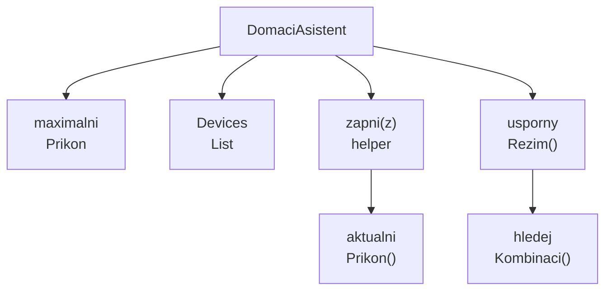

Sources: [DomaciAsistent.java:7-15](), [DomaciAsistent.java:86-102](), [DomaciAsistent.java:137-151](), [DomaciAsistent.java:153-155](), [DomaciAsistent.java:175-184]()

---

## Scenarios System

### `Scenario` Class

`Scenario` represents a named list of actions to be run later. Each action is a `Runnable` with an associated textual description.  
Sources: [Scenario.java:5-29]()

Key members:

- `private final String nazev;`  
- `private final List<Runnable> akce = new ArrayList<>();`  
- `private final List<String> popisy = new ArrayList<>();`  

Methods:

- Constructor sets `nazev`.  
- `String getNazev()` returns the scenario name.  
- `void pridejAkci(String popis, Runnable runnable)` appends the description and action.  
- `void vypis()` prints scenario name and indented descriptions.  
- `void spust()` prints start message and sequentially runs all `Runnable` actions.  

Sources: [Scenario.java:5-29]()

### Scenario Lifecycle in `DomaciAsistent`

`DomaciAsistent` manages a list of scenarios and provides methods to create, list, run, and remove them.  
Sources: [DomaciAsistent.java:7-15](), [DomaciAsistent.java:186-208](), [DomaciAsistent.java:110-136]()

#### Creating a Scenario: `vytvorScenar()`

Flow:

1. Prompt for scenario name and create `Scenario s = new Scenario(scanner.nextLine());`.  
2. Enter loop displaying action options:
   - `1 Zapnout zařízení` (turn on device)  
   - `2 Vypnout zařízení` (turn off device)  
   - `3 Přehrát službu` (play service)  
   - `4 Zastavit službu` (stop service)  
   - `0 Hotovo` (done)  
3. For device actions (1,2):
   - Use `najdiZarizeni("zařízení pro akci")`.  
   - If found, add an action with description `"Zapnout <nazev>"` or `"Vypnout <nazev>"`.  
   - For turning on, use lambda `() -> zapni(z)`; for off, method reference `z::vypni`.  
4. For service actions (3,4):
   - Use `najdiSluzbu()`.  
   - On play (3), prompt for title and add `() -> sl.prehrat(t)`.  
   - On stop (4), add `sl::stop`.  
5. After exiting loop, add scenario to `scenare`.  

Sources: [DomaciAsistent.java:110-136](), [DomaciAsistent.java:186-208]()

#### Listing and Running Scenarios

- `vypisScenare()`:
  - If empty, prints placeholder.  
  - Otherwise calls `s.vypis()` on each scenario.  

- `spustScenar()`:
  - Calls `najdiScenar()` to select by name.  
  - If not null, calls `s.spust()`.  

- `odstranScenar()`:
  - Calls `najdiScenar()`.  
  - If found, removes it from list and prints confirmation.  

`najdiScenar()` prompts for scenario name and searches `scenare` by case-insensitive `getNazev()`.  
Sources: [DomaciAsistent.java:136-151](), [DomaciAsistent.java:208-218](), [Scenario.java:5-29]()

### Scenario Sequence Diagram

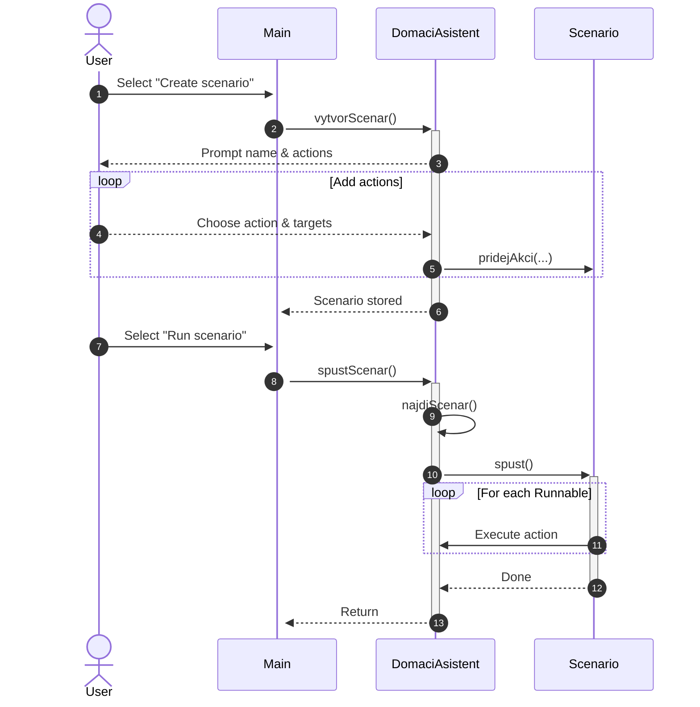

Sources: [Main.java:13-43](), [DomaciAsistent.java:110-136](), [DomaciAsistent.java:208-218](), [Scenario.java:5-29]()

---

## Statistics and Activity Reporting

### Active Devices and Services

`vypisAktivni()` reports:

- “Zapnutá zařízení:” followed by all devices where `stav().equals("zapnuto")`.  
- “Spuštěné služby:” followed by each service where `prehrava()` is true, with name and launch count.  

Sources: [DomaciAsistent.java:135-147](), [ISmartDevice.java:3-18](), [IStreamingService.java:3-15]()

### Usage Statistics

`vypisStatistiku()` computes:

- Most-used device: max by `getPocetSpusteni()` on `zarizeni`.  
- Most-used service: max by `getPocetSpusteni()` on `sluzby`.  
- Sum of device starts and service starts across all entities.  

It prints a "Statistika" section summarizing:

- "Nejpoužívanější zařízení" with name and count or "žádné".  
- "Nejpoužívanější služba" with name and count or "žádná".  
- "Součet spuštění všech zařízení" and "Součet spuštění všech služeb".  

Sources: [DomaciAsistent.java:147-151](), [ZakladniZarizeni.java:22-32](), [Netflix.java:3-23](), [Spotify.java:3-23](), [YouTube.java:3-23]()

---

## I/O Utilities and Validation

### Input Helpers

`DomaciAsistent` provides small wrappers around `Scanner`:

- `nactiInt(String p)`:
  - Prints prompt, reads `int` via `scanner.nextInt()`, then consumes newline.  

- `nactiDouble(String p)`:
  - Prints prompt, reads `double`, then consumes newline.  

- `nactiRozsah(String p, int d, int min, int max)`:
  - Prints prompt, reads a whole line.  
  - If empty (trimmed), returns default `d`.  
  - Otherwise parses integer, clamps to `[min, max]`.  

Sources: [DomaciAsistent.java:220-237]()

### Device Data Validation

`ZakladniZarizeni` enforces:

- Name non-null and non-empty in constructor and `setNazev`.  
- Non-negative power.  
- Priority between 1 and 10 inclusive.  

Violations result in `IllegalArgumentException` with descriptive messages.  
Sources: [ZakladniZarizeni.java:7-21](), [ZakladniZarizeni.java:26-32]()

---

## Summary

The system is structured around `DomaciAsistent` as the central orchestrator, with clearly separated concerns for smart devices, streaming services, scenarios, and user interaction via the `Main` menu loop. Devices and services adhere to small, focused interfaces (`ISmartDevice`, `IStreamingService`), enabling a uniform control layer for power management, statistics, and scenario composition. Shared device logic is encapsulated in `ZakladniZarizeni`, while `SmartLight` and `SmartThermostat` provide concrete behaviors. Streaming services (`Netflix`, `Spotify`, `YouTube`) implement a consistent playback state pattern. Scenarios leverage `Runnable` actions to capture reusable sequences that combine device control and media playback under the assistant’s coordination.  
Sources: [Main.java:7-43](), [DomaciAsistent.java:7-24](), [ISmartDevice.java:3-18](), [IStreamingService.java:3-15](), [ZakladniZarizeni.java:3-48](), [SmartLight.java:3-18](), [SmartThermostat.java:3-32](), [Netflix.java:3-23](), [Spotify.java:3-23](), [YouTube.java:3-23](), [Scenario.java:5-29]()

---

<a id="page-3"></a>

## Smart Devices Model and Power Management

**Related Files**:
- `src/ISmartDevice.java`
- `src/ZakladniZarizeni.java`
- `src/SmartLight.java`
- `src/SmartThermostat.java`
- `src/DomaciAsistent.java`

**Related Pages**:
- [Architecture and Component Overview](#page-2)
- [User Interaction, Scenarios, and Workflows](#page-5)

<details>
<summary>Relevant source files</summary>

The following files were used as context for generating this wiki page:

- [src/ISmartDevice.java](https://github.com/Mir04ange/SOmeShitss/blob/main/src/ISmartDevice.java)
- [src/ZakladniZarizeni.java](https://github.com/Mir04ange/SOmeShitss/blob/main/src/ZakladniZarizeni.java)
- [src/SmartLight.java](https://github.com/Mir04ange/SOmeShitss/blob/main/src/SmartLight.java)
- [src/SmartThermostat.java](https://github.com/Mir04ange/SOmeShitss/blob/main/src/SmartThermostat.java)
- [src/DomaciAsistent.java](https://github.com/Mir04ange/SOmeShitss/blob/main/src/DomaciAsistent.java)
- [src/IStreamingService.java](https://github.com/Mir04ange/SOmeShitss/blob/main/src/IStreamingService.java)
- [src/Netflix.java](https://github.com/Mir04ange/SOmeShitss/blob/main/src/Netflix.java)
- [src/Spotify.java](https://github.com/Mir04ange/SOmeShitss/blob/main/src/Spotify.java)
- [src/YouTube.java](https://github.com/Mir04ange/SOmeShitss/blob/main/src/YouTube.java)
- [src/Scenario.java](https://github.com/Mir04ange/SOmeShitss/blob/main/src/Scenario.java)
- [src/Main.java](https://github.com/Mir04ange/SOmeShitss/blob/main/src/Main.java)
</details>

# Smart Devices Model and Power Management

## Introduction

The Smart Devices Model and Power Management subsystem represents how the “Domácí Asistent” application models smart devices, tracks their usage, and manages household power limits. It defines common behavior via interfaces and base classes, concrete device implementations (lights, thermostats), and orchestration logic that enforces a configurable power limit, supports an “energy saving” mode, and integrates with user-defined scenarios.  
Sources: [ISmartDevice.java:1-16](), [ZakladniZarizeni.java:1-55](), [SmartLight.java:1-24](), [SmartThermostat.java:1-37](), [DomaciAsistent.java:1-241]()

This page focuses on the object model for devices, priority and power attributes, runtime monitoring of current consumption, and the algorithm that finds an optimal subset of devices to keep powered under a global limit. It also describes how these capabilities are made available through the main assistant class and the interactive console UI.  
Sources: [DomaciAsistent.java:1-241](), [Main.java:1-54]()

---

## Core Device Model

Sources: [ISmartDevice.java:1-16](), [ZakladniZarizeni.java:1-55](), [SmartLight.java:1-24](), [SmartThermostat.java:1-37]()

### ISmartDevice interface

`ISmartDevice` defines the minimal contract for all smart devices managed by the assistant.  

```java
public interface ISmartDevice {
    void zapni();
    void vypni();
    String stav();
    String getNazev();
    void setNazev(String nazev);
    int getPocetSpusteni();

    default double getPrikon() {
        return 0;
    }

    default int getPriorita() {
        return 1;
    }
}
```

Key aspects:  
- Lifecycle operations: `zapni()`, `vypni()`.  
- State introspection: `stav()` returns `"zapnuto"` or `"vypnuto"` in implementations.  
- Identification: `getNazev()`, `setNazev(String)`.  
- Usage tracking: `getPocetSpusteni()` counts how many times the device was turned on.  
- Power-related defaults: `getPrikon()` and `getPriorita()` have default values but are overridden by concrete implementations.  
Sources: [ISmartDevice.java:1-16]()

### ZakladniZarizeni: common implementation

`ZakladniZarizeni` is an abstract base class providing a standard implementation for common device behavior and power attributes. It implements `ISmartDevice`.  

```java
public abstract class ZakladniZarizeni implements ISmartDevice {

    private String nazev;
    private boolean zapnuto;
    private int pocetSpusteni;
    private final double prikon;
    private final int priorita;

    protected ZakladniZarizeni(String nazev, double prikon, int priorita) {
        if (nazev == null || nazev.trim().isEmpty()) throw new IllegalArgumentException("Název nesmí být prázdný.");
        if (prikon < 0) throw new IllegalArgumentException("Příkon nesmí být záporný.");
        if (priorita < 1 || priorita > 10) throw new IllegalArgumentException("Priorita musí být 1 až 10.");
        this.nazev = nazev;
        this.prikon = prikon;
        this.priorita = priorita;
    }
    ...
}
```

Key behavior:  
- Validates constructor arguments: non-empty name, non-negative power, priority between 1 and 10.  
- `zapni()` toggles `zapnuto` to true and increments `pocetSpusteni` once per transition to on.  
- `vypni()` sets `zapnuto` to false.  
- `stav()` returns `"zapnuto"` or `"vypnuto"` based on internal boolean.  
- Overrides `getPrikon()` and `getPriorita()` to return immutable constructor-set values.  
- Provides `toString()` including name, state, power, priority, and number of starts.  
Sources: [ZakladniZarizeni.java:1-55]()

Additional helpers:  
- `boolean isZapnuto()` / `void setZapnuto(boolean)` expose the on/off flag to subclasses like `SmartThermostat`.  
Sources: [ZakladniZarizeni.java:33-40]()

### Concrete devices

#### SmartLight

`SmartLight` is a simple device implementation for lights. It extends `ZakladniZarizeni`.  

```java
class SmartLight extends ZakladniZarizeni {

    public SmartLight(String nazev) {
        this(nazev, 60, 5);
    }

    public SmartLight(String nazev, double prikon, int priorita) {
        super(nazev, prikon, priorita);
    }

    @Override
    public String toString() {
        return (
            getNazev() +
            " - " +
            stav() +
            " (" +
            getPrikon() +
            " W, priorita " +
            getPriorita() +
            ", spuštění " +
            getPocetSpusteni() +
            ")"
        );
    }
}
```

Characteristics:  
- Default constructor: 60 W power, priority 5.  
- Delegates lifecycle and power logic to `ZakladniZarizeni`.  
- Custom `toString()` that mirrors the base but accesses data via getters.  
Sources: [SmartLight.java:1-24]()

#### SmartThermostat

`SmartThermostat` extends `ZakladniZarizeni` and adds a temperature attribute.  

```java
class SmartThermostat extends ZakladniZarizeni {

    private double teplota;

    public SmartThermostat(String nazev, double teplota) {
        this(nazev, teplota, 1500, 8);
    }

    public SmartThermostat(String nazev, double teplota, double prikon, int priorita) {
        super(nazev, prikon, priorita);
        this.teplota = teplota;
    }
    ...
}
```

Behavior:  
- Default constructor uses 1500 W power and priority 8.  
- `nastavTeplotu(double)` updates the internal temperature and logs to stdout.  
- Overrides `zapni()` to avoid incrementing usage if already on and instead prints a status message with current temperature. If off, it delegates to `super.zapni()`.  
- `toString()` appends temperature to the base representation.  
Sources: [SmartThermostat.java:1-37]()

### Class relationships

The following diagram shows the relationships among the core model classes.

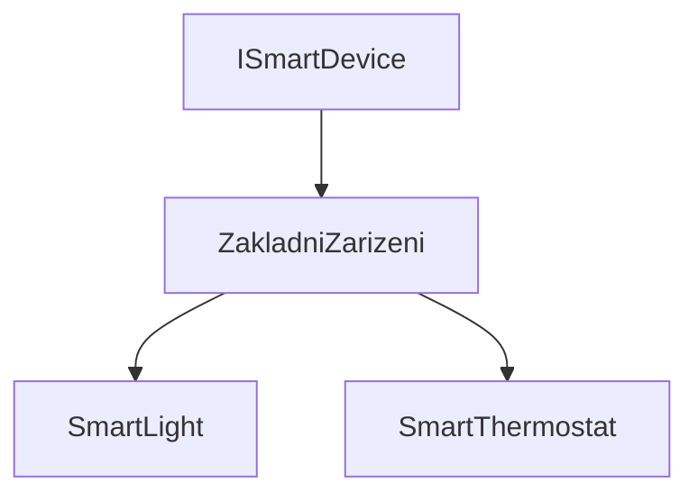

Sources: [ISmartDevice.java:1-16](), [ZakladniZarizeni.java:1-55](), [SmartLight.java:1-24](), [SmartThermostat.java:1-37]()

---

## Assistant Orchestration and Device Registry

Sources: [DomaciAsistent.java:1-241]()

### DomaciAsistent overview

`DomaciAsistent` is the central orchestrator class that maintains registries of devices, streaming services, and scenarios, and exposes the main operations used by the UI.  

Key fields related to devices and power:

```java
private final List<ISmartDevice> zarizeni = new ArrayList<>();
private final List<IStreamingService> sluzby = new ArrayList<>();
private final List<Scenario> scenare = new ArrayList<>();
private final Scanner scanner;
private double maximalniPrikon = Double.POSITIVE_INFINITY;
```

- `zarizeni`: list of all registered smart devices.  
- `sluzby`: list of streaming services (e.g., Netflix, Spotify, YouTube).  
- `scenare`: user-defined scenarios.  
- `maximalniPrikon`: global power limit for the household, defaulting to infinity (no limit).  
Sources: [DomaciAsistent.java:5-13]()

The constructor initializes a `Scanner` and pre-registers three streaming services (`Netflix`, `Spotify`, `YouTube`).  
Sources: [DomaciAsistent.java:15-19]()

### Device lifecycle operations

#### Adding a device

`pridejZarizeni()` interacts with the user to create and register either a `SmartLight` or `SmartThermostat`, including custom power and priority values.

Key logic:  
- Prompts for type (1 = `SmartLight`, 2 = `SmartThermostat`).  
- Reads device name.  
- Optionally reads power (defaults: 60 W for light, 1500 W for thermostat if not specified).  
- Reads priority in the range 1–10, defaulting to 5 if left blank, coerced to min/max if out of bounds.  
- For thermostats, also reads initial temperature.  
- Constructs the appropriate device and appends it to `zarizeni`.  
Sources: [DomaciAsistent.java:21-37](), [DomaciAsistent.java:225-239](), [SmartLight.java:1-12](), [SmartThermostat.java:1-12]()

#### Removing and listing devices

- `odeberZarizeni()` prompts for a device (using `najdiZarizeni`) and removes it if found.  
- `vypisZarizeni()` prints all managed devices via each device’s `toString()`.  
Sources: [DomaciAsistent.java:39-55](), [DomaciAsistent.java:177-188]()

#### Renaming devices

`prepisNazevZarizeni()` locates a device and sets a new name via `setNazev`, leveraging validation in `ZakladniZarizeni`.  
Sources: [DomaciAsistent.java:57-66](), [ZakladniZarizeni.java:23-32]()

#### Bulk on/off operations

- `zapniVse()` iterates over `zarizeni` and calls the assistant’s private `zapni(ISmartDevice)` method for each.  
- `vypniVse()` directly calls `vypni()` on each device.  
Sources: [DomaciAsistent.java:68-79]()

### Device lookup helpers

`najdiZarizeni(String prompt)` supports multiple features by listing devices and asking the user for a case-insensitive name match; returns the device or null.  
Sources: [DomaciAsistent.java:177-188]()

---

## Power Monitoring and Limit Enforcement

Sources: [DomaciAsistent.java:81-118](), [DomaciAsistent.java:151-175](), [ZakladniZarizeni.java:1-55]()

### Central power limit

`maximalniPrikon` represents the maximum allowed total power of simultaneously active devices. It is initialized to `Double.POSITIVE_INFINITY`, meaning unbounded until explicitly set.  
Sources: [DomaciAsistent.java:11-13]()

`nastavLimitPrikonu()` prompts the user for a new limit (in watts) and updates `maximalniPrikon`.  

```java
public void nastavLimitPrikonu() {
    maximalniPrikon = nactiDouble("Maximální povolený příkon domácnosti ve wattech: ");
    System.out.println("Limit nastaven na " + maximalniPrikon + " W.");
}
```

Sources: [DomaciAsistent.java:133-138](), [DomaciAsistent.java:217-224]()

### Current consumption calculation

`aktualniPrikon()` is a private method that sums the power (`getPrikon()`) of all currently powered devices (`stav().equals("zapnuto")`).

```java
private double aktualniPrikon() {
    return zarizeni.stream()
        .filter(z -> z.stav().equals("zapnuto"))
        .mapToDouble(ISmartDevice::getPrikon)
        .sum();
}
```

Sources: [DomaciAsistent.java:151-155](), [ISmartDevice.java:9-14](), [ZakladniZarizeni.java:41-46]()

### Enforced turn-on logic

The private `zapni(ISmartDevice z)` method enforces the power limit whenever a device is turned on—both in direct user operations and within scenarios.

```java
private void zapni(ISmartDevice z) {
    if (z.stav().equals("zapnuto")) {
        System.out.println(z.getNazev() + " je již zapnuto.");
        return;
    }
    if (aktualniPrikon() + z.getPrikon() > maximalniPrikon) {
        System.out.println(
            "Upozornění: zařízení " + z.getNazev() + " nelze zapnout, překročil by se limit příkonu."
        );
        return;
    }
    z.zapni();
}
```

Behavior:  
1. If already on, prints a message and returns with no effect.  
2. Computes `aktualniPrikon() + z.getPrikon()` and refuses to turn on the device if this exceeds `maximalniPrikon`.  
3. Otherwise, calls the device’s `zapni()` implementation.  

Sources: [DomaciAsistent.java:81-95]()

This method is used by:  
- `zapniVse()` to bulk-enable devices safely.  
- `zapniJedno(ISmartDevice)` as a wrapper.  
- Scenario actions that model “Zapnout [device]” callbacks.  
Sources: [DomaciAsistent.java:68-76](), [DomaciAsistent.java:97-99](), [DomaciAsistent.java:157-176]()

### Consumption and capacity reporting

`vypisSpotrebu()` prints:  
- Current consumption (`aktualniPrikon`).  
- Remaining capacity (difference between `maximalniPrikon` and `aktualniPrikon`), or “unlimited” if infinite.  
- The device with the highest power draw.  

```java
public void vypisSpotrebu() {
    double aktualni = aktualniPrikon();
    double rezerva = Double.isInfinite(maximalniPrikon) ? 0 : Math.max(0, maximalniPrikon - aktualni);
    System.out.println(
        "Aktuální spotřeba: " +
        aktualni +
        " W\nZbývající rezerva: " +
        (Double.isInfinite(maximalniPrikon) ? "neomezená" : rezerva + " W")
    );
    ISmartDevice max = zarizeni.stream().max(Comparator.comparingDouble(ISmartDevice::getPrikon)).orElse(null);
    System.out.println(
        "Největší příkon má: " + (max == null ? "žádné zařízení" : max.getNazev() + " (" + max.getPrikon() + " W)")
    );
}
```

Sources: [DomaciAsistent.java:140-150](), [ZakladniZarizeni.java:41-46]()

### Power-related data flow

The following diagram shows how power limit and consumption are evaluated when enabling a device:

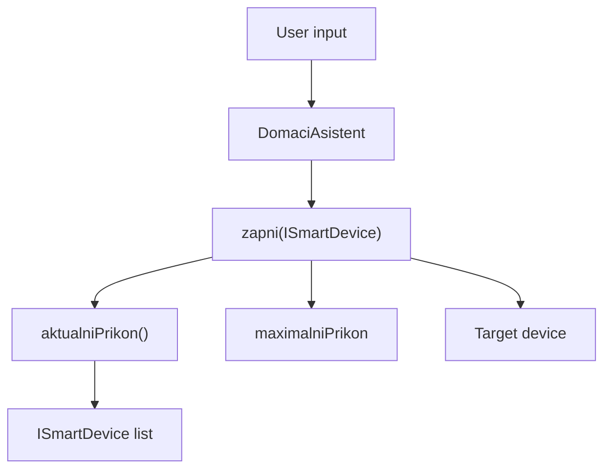

Sources: [DomaciAsistent.java:68-79](), [DomaciAsistent.java:81-95](), [DomaciAsistent.java:151-155]()

---

## Energy Saving Mode (Úsporný režim)

Sources: [DomaciAsistent.java:157-176](), [DomaciAsistent.java:151-155](), [ISmartDevice.java:9-15](), [ZakladniZarizeni.java:41-50]()

### Purpose

The “energy saving mode” (`uspornyRezim()`) computes an optimal subset of currently active devices that fits within the configured power limit while maximizing total priority. Among subsets with equal total priority, it prefers the one with the lower total power. All other devices are turned off.  
Sources: [DomaciAsistent.java:157-176]()

### Algorithm overview

`uspornyRezim()` workflow:  
1. Builds a list `zapnuta` with all devices whose `stav()` is `"zapnuto"`.  
2. Initializes tracking fields:  
   - `nejlepsiKombinace` (best subset of devices).  
   - `nejlepsiPriorita` (best total priority, initially -1).  
   - `nejlepsiKombinacePrikon` (total power of the best subset, initially `Double.POSITIVE_INFINITY`).  
3. Calls recursive helper `hledejKombinaci(...)` to explore all subsets.  
4. After search, any initially active device not in `nejlepsiKombinace` is turned off via `vypni()`.  
5. Prints how many devices remain on and their total power consumption.  
Sources: [DomaciAsistent.java:157-176]()

Recursive helper `hledejKombinaci(...)`:

```java
private void hledejKombinaci(
    List<ISmartDevice> kandidati,
    int index,
    List<ISmartDevice> vybrana,
    int priorita,
    double prikon
) {
    if (prikon > maximalniPrikon) return;
    if (index == kandidati.size()) {
        if (priorita > nejlepsiPriorita || (priorita == nejlepsiPriorita && prikon < nejlepsiKombinacePrikon)) {
            nejlepsiPriorita = priorita;
            nejlepsiKombinacePrikon = prikon;
            nejlepsiKombinace = new ArrayList<>(vybrana);
        }
        return;
    }
    hledejKombinaci(kandidati, index + 1, vybrana, priorita, prikon);
    ISmartDevice z = kandidati.get(index);
    vybrana.add(z);
    hledejKombinaci(kandidati, index + 1, vybrana, priorita + z.getPriorita(), prikon + z.getPrikon());
    vybrana.remove(vybrana.size() - 1);
}
```

Key properties:  
- Prunes branches where partial `prikon` already exceeds `maximalniPrikon`.  
- At leaf nodes (`index == kandidati.size()`), updates the best combination if:  
  - total priority is higher, or  
  - equal priority but lower total power.  
- Explores all subsets (exclude current, then include current) via recursion.  
Sources: [DomaciAsistent.java:157-176](), [ISmartDevice.java:12-15](), [ZakladniZarizeni.java:41-50]()

### Energy saving flow diagram

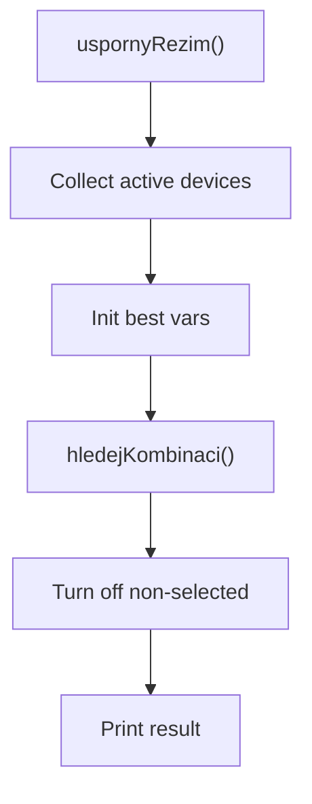

Sources: [DomaciAsistent.java:157-176]()

### Priority and power fields

Each device carries:  
- `prikon` (power in watts).  
- `priorita` (integer 1–10).  

They are set via the `ZakladniZarizeni` constructor and accessed through `getPrikon()` and `getPriorita()`. These values are used directly by `hledejKombinaci`.  
Sources: [ZakladniZarizeni.java:7-21](), [ZakladniZarizeni.java:41-50](), [DomaciAsistent.java:157-176]()

### Energy saving mode summary table

| Aspect                      | Description                                                                                  | Sources |
|----------------------------|----------------------------------------------------------------------------------------------|---------|
| Input devices              | Currently “zapnuto” devices in `zarizeni`                                                   | [DomaciAsistent.java:157-162]() |
| Optimization goal          | Maximize sum of device priorities, then minimize total power for ties                       | [DomaciAsistent.java:166-175]() |
| Constraint                 | Total power ≤ `maximalniPrikon`                                                             | [DomaciAsistent.java:166-175]() |
| Output                     | Best subset left on; other previously on devices turned off                                 | [DomaciAsistent.java:162-164]() |
| Reporting                  | Number of devices left on and summed power of kept devices                                  | [DomaciAsistent.java:162-164]() |

---

## Streaming Services and Scenarios Interaction with Devices

Although primarily focused on power and devices, the system also integrates streaming services and scenarios, which can indirectly affect power management when scenarios call device operations.

Sources: [DomaciAsistent.java:101-131](), [Scenario.java:1-32](), [IStreamingService.java:1-14](), [Netflix.java:1-25](), [Spotify.java:1-25](), [YouTube.java:1-25]()

### IStreamingService and implementations (brief)

`IStreamingService` defines:  

```java
public interface IStreamingService {
    void prehrat(String nazevTitulu);
    void stop();
    boolean prehrava();

    default String getNazev() {
        return getClass().getSimpleName();
    }

    default int getPocetSpusteni() {
        return 0;
    }
}
```

Implementations (`Netflix`, `Spotify`, `YouTube`) track `prehravani` and `pocetSpusteni`, incrementing the count on each new `prehrat` when not already playing.  
Sources: [IStreamingService.java:1-14](), [Netflix.java:1-25](), [Spotify.java:1-25](), [YouTube.java:1-25]()

These services do not contribute to the power accounting in `DomaciAsistent`, which only sums `ISmartDevice` power, but they are part of overall system statistics and scenarios.  
Sources: [DomaciAsistent.java:105-129]()

### Scenario orchestration with devices

`Scenario` represents a named sequence of actions (Runnable callbacks) and descriptions.  

```java
class Scenario {

    private final String nazev;
    private final List<Runnable> akce = new ArrayList<>();
    private final List<String> popisy = new ArrayList<>();

    Scenario(String nazev) {
        this.nazev = nazev;
    }

    void pridejAkci(String popis, Runnable runnable) {
        popisy.add(popis);
        akce.add(runnable);
    }

    void spust() {
        System.out.println("Spouštím scénář: " + nazev);
        for (Runnable runnable : akce) runnable.run();
    }
}
```

Sources: [Scenario.java:1-32]()

`DomaciAsistent.vytvorScenar()` binds device-level operations, such as turning devices on or off, into scenario steps:

- For “Zapnout zařízení” (option 1), it adds a `Runnable` that calls `zapni(z)`.  
- For “Vypnout zařízení” (option 2), it adds a `Runnable` referencing `z::vypni`.  

```java
if (volba == 1 || volba == 2) {
    ISmartDevice z = najdiZarizeni("zařízení pro akci");
    if (z != null) {
        if (volba == 1) 
            s.pridejAkci("Zapnout " + z.getNazev(), () -> zapni(z));
        else 
            s.pridejAkci("Vypnout " + z.getNazev(), z::vypni);
    }
}
```

When the scenario is later run via `spustScenar()`, all added actions are executed in order, and any `zapni(z)` calls will still enforce the global power limit and interact with the energy-saving context transparently.  
Sources: [DomaciAsistent.java:157-176](), [DomaciAsistent.java:190-215](), [Scenario.java:1-32]()

### Scenario execution and power

The following diagram outlines how scenarios play back device actions with power enforcement:

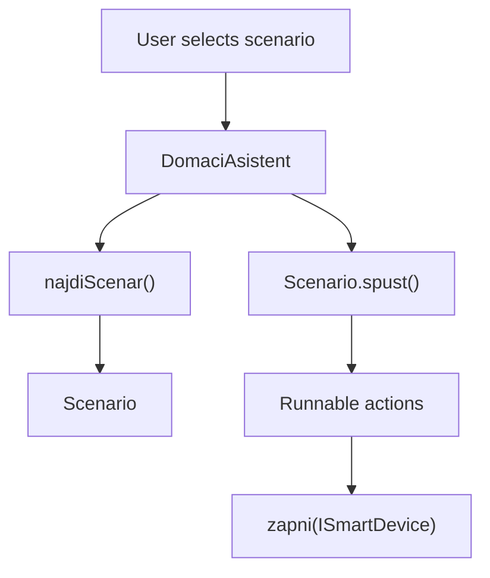

Sources: [DomaciAsistent.java:201-215](), [Scenario.java:15-32](), [DomaciAsistent.java:81-95]()

---

## Statistics and Active State Reporting

Sources: [DomaciAsistent.java:105-131](), [ZakladniZarizeni.java:13-22](), [Netflix.java:1-25](), [Spotify.java:1-25](), [YouTube.java:1-25]()

### Active devices and services

`vypisAktivni()` prints:  
- All devices whose `stav()` is `"zapnuto"`.  
- All streaming services where `prehrava()` is true, plus each service’s number of starts.  

```java
public void vypisAktivni() {
    System.out.println("Zapnutá zařízení:");
    for (ISmartDevice z : zarizeni) 
        if (z.stav().equals("zapnuto")) System.out.println(z);
    System.out.println("Spuštěné služby:");
    for (IStreamingService s : sluzby) 
        if (s.prehrava()) 
            System.out.println(s.getNazev() + " (spuštění " + s.getPocetSpusteni() + ")");
}
```

Sources: [DomaciAsistent.java:105-113](), [ISmartDevice.java:3-8](), [IStreamingService.java:1-7](), [Netflix.java:1-25](), [Spotify.java:1-25](), [YouTube.java:1-25]()

### Usage statistics

`vypisStatistiku()` computes:  
- Most used device (by `getPocetSpusteni()`).  
- Most used streaming service.  
- Total starts across all devices and across all services.  

```java
ISmartDevice zdroj = zarizeni
    .stream()
    .max(Comparator.comparingInt(ISmartDevice::getPocetSpusteni))
    .orElse(null);
IStreamingService sluzba = sluzby
    .stream()
    .max(Comparator.comparingInt(IStreamingService::getPocetSpusteni))
    .orElse(null);
int soucetZ = zarizeni.stream().mapToInt(ISmartDevice::getPocetSpusteni).sum();
int soucetS = sluzby.stream().mapToInt(IStreamingService::getPocetSpusteni).sum();
```

It then prints formatted text describing these statistics.  
Sources: [DomaciAsistent.java:115-131](), [ZakladniZarizeni.java:17-22](), [Netflix.java:17-24](), [Spotify.java:17-24](), [YouTube.java:17-24]()

---

## User Interface Integration

Although not part of the model itself, the console UI in `Main` exposes all power-management-related operations to the user.  

```java
System.out.println("12 Nastavit limit příkonu | 13 Aktuální spotřeba | 14 Úsporný režim");
...
case 12:
    a.nastavLimitPrikonu();
    break;
case 13:
    a.vypisSpotrebu();
    break;
case 14:
    a.uspornyRezim();
    break;
```

This ties the power limit configuration, current consumption reporting, and energy saving mode into the primary menu loop.  
Sources: [Main.java:21-49](), [DomaciAsistent.java:133-150](), [DomaciAsistent.java:157-176]()

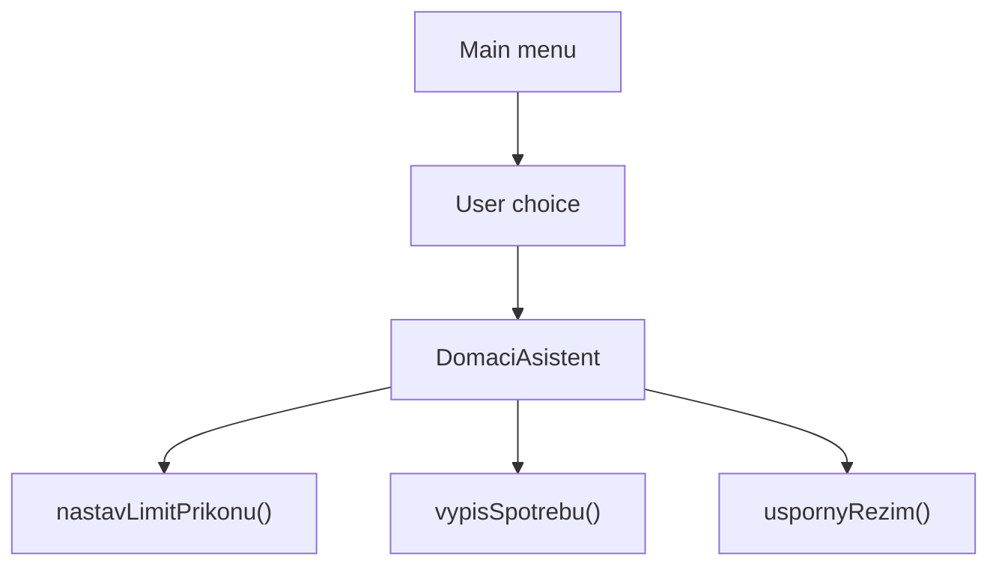

Sources: [Main.java:9-54](), [DomaciAsistent.java:133-150](), [DomaciAsistent.java:157-176]()

---

## Summary

The Smart Devices Model and Power Management subsystem is centered around the `ISmartDevice` interface, the `ZakladniZarizeni` base class, and concrete implementations like `SmartLight` and `SmartThermostat`. It tracks on/off state, usage counts, power draw, and priority for each device and uses these attributes to enforce a configurable global power limit. Through `DomaciAsistent`, the system provides operations for configuring the limit, monitoring current consumption, and executing an energy saving mode that selects an optimal subset of devices based on priority and power. These capabilities integrate with streaming services, statistics, and user-defined scenarios, and are exposed via the console UI in `Main`.  
Sources: [ISmartDevice.java:1-16](), [ZakladniZarizeni.java:1-55](), [SmartLight.java:1-24](), [SmartThermostat.java:1-37](), [DomaciAsistent.java:1-241](), [Main.java:1-54]()

---

<a id="page-4"></a>

## Streaming Services and Media Control

**Related Files**:
- `src/IStreamingService.java`
- `src/Netflix.java`
- `src/Spotify.java`
- `src/YouTube.java`
- `src/DomaciAsistent.java`

**Related Pages**:
- [Architecture and Component Overview](#page-2)
- [User Interaction, Scenarios, and Workflows](#page-5)

<details>
<summary>Relevant source files</summary>

The following files were used as context for generating this wiki page:

- [src/IStreamingService.java](https://github.com/Mir04ange/SOmeShitss/blob/main/src/IStreamingService.java)
- [src/Netflix.java](https://github.com/Mir04ange/SOmeShitss/blob/main/src/Netflix.java)
- [src/Spotify.java](https://github.com/Mir04ange/SOmeShitss/blob/main/src/Spotify.java)
- [src/YouTube.java](https://github.com/Mir04ange/SOmeShitss/blob/main/src/YouTube.java)
- [src/DomaciAsistent.java](https://github.com/Mir04ange/SOmeShitss/blob/main/src/DomaciAsistent.java)
- [src/Main.java](https://github.com/Mir04ange/SOmeShitss/blob/main/src/Main.java)
</details>

# Streaming Services and Media Control

## Introduction

The streaming services and media control subsystem provides a unified abstraction for playing and stopping media across multiple streaming platforms (Netflix, Spotify, YouTube) inside the home assistant console application. It defines a simple interface for playback control and integrates these services into user workflows such as playing content on all services, managing active playback, collecting usage statistics, and composing multi-step scenarios.  
Sources: [IStreamingService.java:1-12](), [Netflix.java:1-25](), [Spotify.java:1-25](), [YouTube.java:1-25](), [DomaciAsistent.java:1-37](), [Main.java:1-40]()

Within the overall project, the `DomaciAsistent` class owns and coordinates all streaming services, exposing commands through the text-based menu in `Main`. Media-related operations are handled alongside smart device management but are cleanly separated via the `IStreamingService` interface and its implementations.  
Sources: [DomaciAsistent.java:5-19](), [DomaciAsistent.java:69-86](), [DomaciAsistent.java:102-123](), [Main.java:7-40]()

---

## Architecture Overview

Sources: [IStreamingService.java:1-12](), [Netflix.java:1-25](), [Spotify.java:1-25](), [YouTube.java:1-25](), [DomaciAsistent.java:5-19, 69-86, 124-201](), [Main.java:7-40]()

The streaming subsystem is built around a small set of core components:

| Component           | Type      | Responsibility                                                                 |
|---------------------|-----------|-------------------------------------------------------------------------------|
| `IStreamingService` | Interface | Defines the contract for playback control and basic metadata (name, count).  |
| `Netflix`           | Class     | Concrete streaming service implementing `IStreamingService`.                  |
| `Spotify`           | Class     | Concrete streaming service implementing `IStreamingService`.                  |
| `YouTube`           | Class     | Concrete streaming service implementing `IStreamingService`.                  |
| `DomaciAsistent`   | Class     | Owns and coordinates streaming services; exposes higher-level operations.     |
| `Main`             | Class     | CLI entry point; maps menu options to assistant media operations.             |

Sources: [IStreamingService.java:1-12](), [Netflix.java:1-25](), [Spotify.java:1-25](), [YouTube.java:1-25](), [DomaciAsistent.java:5-19, 69-86, 124-201](), [Main.java:7-40]()

### Class Relationships

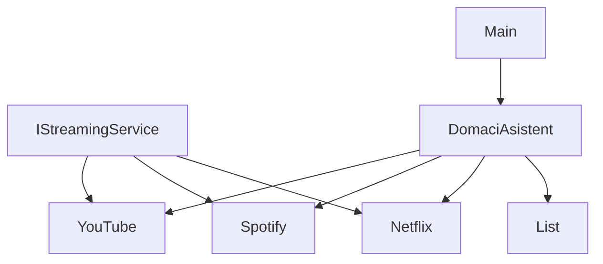

This diagram shows `Netflix`, `Spotify`, and `YouTube` as implementations of `IStreamingService`, all owned by `DomaciAsistent`, which is used by `Main`.  
Sources: [IStreamingService.java:1-12](), [Netflix.java:1-25](), [Spotify.java:1-25](), [YouTube.java:1-25](), [DomaciAsistent.java:5-19](), [Main.java:7-15]()

---

## IStreamingService Interface

Sources: [IStreamingService.java:1-12]()

### Contract

```java
public interface IStreamingService {
    void prehrat(String nazevTitulu);
    void stop();
    boolean prehrava();

    default String getNazev() {
        return getClass().getSimpleName();
    }

    default int getPocetSpusteni() {
        return 0;
    }
}
```

`IStreamingService` defines:

| Method              | Return  | Description                                                                                         |
|---------------------|---------|-----------------------------------------------------------------------------------------------------|
| `prehrat(String)`   | `void`  | Starts playback of a title identified by its name.                                                 |
| `stop()`            | `void`  | Stops playback.                                                                                     |
| `prehrava()`        | `boolean` | Indicates whether the service is currently playing something.                                     |
| `getNazev()`        | `String` (default) | Returns the simple class name; used as the service display name.                    |
| `getPocetSpusteni()`| `int` (default)    | Returns 0 by default; implementations override it to provide usage statistics.    |

Sources: [IStreamingService.java:1-12]()

These methods form the minimal surface used by `DomaciAsistent` for media control, statistics, and service selection.  
Sources: [DomaciAsistent.java:69-86, 102-123, 152-201]()

---

## Streaming Service Implementations

Sources: [Netflix.java:1-25](), [Spotify.java:1-25](), [YouTube.java:1-25]()

All three services follow the same internal pattern: they maintain a `boolean prehravani` flag and an integer counter `pocetSpusteni` that increments when playback starts from a non-playing state.

### Common Behavior Summary

| Class     | Package visibility | Fields                        | Special Behavior                                                                 |
|----------|--------------------|-------------------------------|----------------------------------------------------------------------------------|
| `Netflix`| `public`           | `prehravani`, `pocetSpusteni` | Increments counter on first `prehrat` call while stopped; logs to console.      |
| `Spotify`| package-private    | `prehravani`, `pocetSpusteni` | Same pattern as `Netflix`, with Spotify-specific console messages.              |
| `YouTube`| package-private    | `prehravani`, `pocetSpusteni` | Same pattern as `Netflix`, with YouTube-specific console messages.              |

Sources: [Netflix.java:1-25](), [Spotify.java:1-25](), [YouTube.java:1-25]()

### Netflix

```java
public class Netflix implements IStreamingService {

    private boolean prehravani;
    private int pocetSpusteni;

    @Override
    public void prehrat(String titul) {
        if (!prehravani) pocetSpusteni++;
        prehravani = true;
        System.out.println("Přehrávání na Netflixu: " + titul);
    }

    @Override
    public void stop() {
        prehravani = false;
        System.out.println("Netflix přehrávání ukončeno.");
    }

    @Override
    public boolean prehrava() {
        return prehravani;
    }

    @Override
    public int getPocetSpusteni() {
        return pocetSpusteni;
    }
}
```

`Netflix` tracks if playback is ongoing and counts how many times playback has started. Repeated `prehrat` calls while already playing do not increment the counter.  
Sources: [Netflix.java:1-25]()

### Spotify

```java
class Spotify implements IStreamingService {

    private boolean prehravani;
    private int pocetSpusteni;

    @Override
    public void prehrat(String titul) {
        if (!prehravani) pocetSpusteni++;
        prehravani = true;
        System.out.println("Přehrávání na Spotify: " + titul);
    }

    @Override
    public void stop() {
        prehravani = false;
        System.out.println("Spotify přehrávání ukončeno.");
    }

    @Override
    public boolean prehrava() {
        return prehravani;
    }

    @Override
    public int getPocetSpusteni() {
        return pocetSpusteni;
    }
}
```

Behavior mirrors `Netflix`, with Spotify-specific messages.  
Sources: [Spotify.java:1-25]()

### YouTube

```java
/** Nová streamovací služba přidaná do domácího asistenta. */
class YouTube implements IStreamingService {

    private boolean prehravani;
    private int pocetSpusteni;

    @Override
    public void prehrat(String titul) {
        if (!prehravani) pocetSpusteni++;
        prehravani = true;
        System.out.println("Přehrávání na YouTube: " + titul);
    }

    @Override
    public void stop() {
        prehravani = false;
        System.out.println("YouTube přehrávání ukončeno.");
    }

    @Override
    public boolean prehrava() {
        return prehravani;
    }

    @Override
    public int getPocetSpusteni() {
        return pocetSpusteni;
    }
}
```

`YouTube` is explicitly documented as a newly added streaming service to the assistant. Its behavior is identical in structure to the other services.  
Sources: [YouTube.java:1-25]()

---

## Service Lifecycle and Management in DomaciAsistent

Sources: [DomaciAsistent.java:5-19, 69-86, 102-123, 152-201]()

### Service Initialization

`DomaciAsistent` constructs and registers all streaming services in its constructor:

```java
private final List<IStreamingService> sluzby = new ArrayList<>();

public DomaciAsistent(Scanner scanner) {
    this.scanner = scanner;
    sluzby.add(new Netflix());
    sluzby.add(new Spotify());
    sluzby.add(new YouTube());
}
```

This ensures there is always exactly one instance of each service available to the assistant.  
Sources: [DomaciAsistent.java:5-7, 13-19]()

### Core Media Operations

#### Play on All Services

```java
public void prehratNaVsechSluzbach() {
    System.out.print("Zadejte název obsahu: ");
    String titul = scanner.nextLine();
    for (IStreamingService s : sluzby) s.prehrat(titul);
}
```

This method prompts for a content title and calls `prehrat` on every registered service.  
Sources: [DomaciAsistent.java:69-76]()

#### Display Active Services

```java
public void vypisAktivni() {
    System.out.println("Zapnutá zařízení:");
    for (ISmartDevice z : zarizeni) if (z.stav().equals("zapnuto")) System.out.println(z);
    System.out.println("Spuštěné služby:");
    for (IStreamingService s : sluzby) if (s.prehrava()) System.out.println(
        s.getNazev() + " (spuštění " + s.getPocetSpusteni() + ")"
    );
}
```

This prints all smart devices that are on and all streaming services currently playing, including their start-count. For services, it uses `prehrava()`, `getNazev()`, and `getPocetSpusteni()`.  
Sources: [DomaciAsistent.java:102-111]()

#### Usage Statistics

```java
public void vypisStatistiku() {
    ISmartDevice zdroj = zarizeni
        .stream()
        .max(Comparator.comparingInt(ISmartDevice::getPocetSpusteni))
        .orElse(null);
    IStreamingService sluzba = sluzby
        .stream()
        .max(Comparator.comparingInt(IStreamingService::getPocetSpusteni))
        .orElse(null);
    int soucetZ = zarizeni.stream().mapToInt(ISmartDevice::getPocetSpusteni).sum();
    int soucetS = sluzby.stream().mapToInt(IStreamingService::getPocetSpusteni).sum();
    System.out.println(
        "Statistika:\nNejpoužívanější zařízení: " +
        (zdroj == null ? "žádné" : zdroj.getNazev() + " (" + zdroj.getPocetSpusteni() + ")")
    );
    System.out.println(
        "Nejpoužívanější služba: " +
        (sluzba == null ? "žádná" : sluzba.getNazev() + " (" + sluzba.getPocetSpusteni() + ")")
    );
    System.out.println("Součet spuštění všech zařízení: " + soucetZ);
    System.out.println("Součet spuštění všech služeb: " + soucetS);
}
```

The assistant uses `getPocetSpusteni()` to compute the most frequently used streaming service and the total number of playback starts across all services.  
Sources: [DomaciAsistent.java:112-123]()

#### Service Selection Helper

```java
private IStreamingService najdiSluzbu() {
    System.out.println("Služby:");
    for (IStreamingService s : sluzby) System.out.println(s.getNazev());
    System.out.print("Zadejte službu: ");
    String n = scanner.nextLine();
    for (IStreamingService s : sluzby) if (s.getNazev().equalsIgnoreCase(n)) return s;
    System.out.println("Služba nebyla nalezena.");
    return null;
}
```

This helper lists all services by `getNazev()` and finds one based on case-insensitive user input.  
Sources: [DomaciAsistent.java:169-180]()

### High-Level Flow: Play on All Services

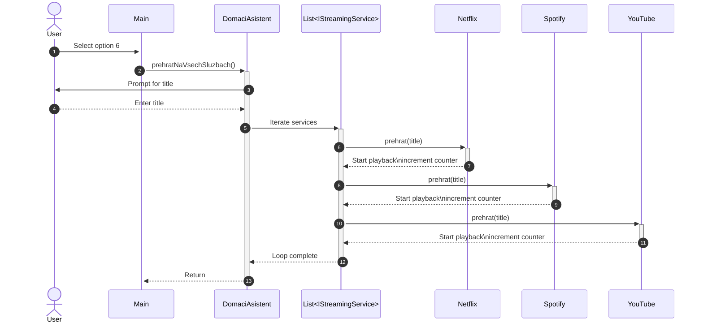

This sequence shows how user input in the CLI leads to playback on all streaming services.  
Sources: [Main.java:21-35](), [DomaciAsistent.java:69-76](), [Netflix.java:7-15](), [Spotify.java:7-15](), [YouTube.java:7-15]()

---

## User Interaction via Main Menu

Sources: [Main.java:7-40](), [DomaciAsistent.java:69-76, 102-123, 152-201]()

`Main` presents a menu that wires media-related options directly to `DomaciAsistent` methods:

```java
System.out.println("6 Přehrát na všech službách | 7 Ovládání termostatu | 8 Konec");
System.out.println("9 Aktivní zařízení a služby | 10 Přejmenovat zařízení | 11 Statistika");
System.out.println("15 Vytvořit scénář | 16 Vypsat scénáře | 17 Spustit scénář | 18 Odstranit scénář");
...
switch (volba) {
    ...
    case 6:
        a.prehratNaVsechSluzbach();
        break;
    case 9:
        a.vypisAktivni();
        break;
    case 11:
        a.vypisStatistiku();
        break;
    case 15:
        a.vytvorScenar();
        break;
    case 16:
        a.vypisScenare();
        break;
    case 17:
        a.spustScenar();
        break;
    case 18:
        a.odstranScenar();
        break;
    ...
}
```

Options 6, 9, 11, and 15–18 are directly relevant to streaming and media control, either by playing content, inspecting active services, viewing statistics, or managing scenarios that include service actions.  
Sources: [Main.java:15-38]()

```mermaid
graph TD
  User["User"] --> MainMenu["Main menu"]
  MainMenu["Main menu"] --> Opt6["Option 6:\nPlay all"]
  MainMenu["Main menu"] --> Opt9["Option 9:\nActive state"]
  MainMenu["Main menu"] --> Opt11["Option 11:\nStats"]
  MainMenu["Main menu"] --> Opt15["Option 15:\nCreate scenario"]
  MainMenu["Main menu"] --> Opt16["Option 16:\nList scenarios"]
  MainMenu["Main menu"] --> Opt17["Option 17:\nRun scenario"]
  MainMenu["Main menu"] --> Opt18["Option 18:\nDelete scenario"]
  Opt6["Option 6:\nPlay all"] --> DAprehrat["DomaciAsistent.\nprehratNaVsechSluzbach"]
  Opt9["Option 9:\nActive state"] --> DAvypisAkt["DomaciAsistent.\nvypisAktivni"]
  Opt11["Option 11:\nStats"] --> DAvypisStat["DomaciAsistent.\nvypisStatistiku"]
  Opt15["Option 15:\nCreate scenario"] --> DAvytvorSc["DomaciAsistent.\nvytvorScenar"]
  Opt16["Option 16:\nList scenarios"] --> DAvypSc["DomaciAsistent.\nvypisScenare"]
  Opt17["Option 17:\nRun scenario"] --> DAsputSc["DomaciAsistent.\nspustScenar"]
  Opt18["Option 18:\nDelete scenario"] --> DAodstrSc["DomaciAsistent.\nodstranScenar"]
```

This flowchart summarizes the mapping from menu choices to assistant methods relevant to streaming.  
Sources: [Main.java:15-38](), [DomaciAsistent.java:69-76, 102-123, 152-201]()

---

## Scenarios with Streaming Actions

Sources: [DomaciAsistent.java:152-201](), [Scenario.java:1-31](), [IStreamingService.java:1-12]()

The project supports user-defined scenarios composed of ordered actions, including streaming service operations.

### Scenario Model

```java
class Scenario {

    private final String nazev;
    private final List<Runnable> akce = new ArrayList<>();
    private final List<String> popisy = new ArrayList<>();

    Scenario(String nazev) {
        this.nazev = nazev;
    }

    String getNazev() {
        return nazev;
    }

    void pridejAkci(String popis, Runnable runnable) {
        popisy.add(popis);
        akce.add(runnable);
    }

    void vypis() {
        System.out.println("- " + nazev);
        for (String popis : popisy) System.out.println("    " + popis);
    }

    void spust() {
        System.out.println("Spouštím scénář: " + nazev);
        for (Runnable runnable : akce) runnable.run();
    }
}
```

Each scenario stores a name, a list of descriptions, and a list of `Runnable` actions to execute in order.  
Sources: [Scenario.java:1-31]()

### Creating Streaming Actions in a Scenario

```java
public void vytvorScenar() {
    System.out.print("Název scénáře: ");
    Scenario s = new Scenario(scanner.nextLine());
    while (true) {
        System.out.println("1 Zapnout zařízení, 2 Vypnout zařízení, 3 Přehrát službu, 4 Zastavit službu, 0 Hotovo");
        int volba = nactiInt("Akce: ");
        if (volba == 0) break;
        if (volba == 1 || volba == 2) {
            ISmartDevice z = najdiZarizeni("zařízení pro akci");
            if (z != null) {
                if (volba == 1) s.pridejAkci("Zapnout " + z.getNazev(), () -> zapni(z)); else s.pridejAkci(
                    "Vypnout " + z.getNazev(),
                    z::vypni
                );
            }
        } else if (volba == 3 || volba == 4) {
            IStreamingService sl = najdiSluzbu();
            if (sl != null) {
                if (volba == 3) {
                    System.out.print("Titul: ");
                    String t = scanner.nextLine();
                    s.pridejAkci("Přehrát " + sl.getNazev(), () -> sl.prehrat(t));
                } else s.pridejAkci("Zastavit " + sl.getNazev(), sl::stop);
            }
        }
    }
    scenare.add(s);
}
```

For streaming services:

- Option 3: Adds an action `() -> sl.prehrat(t)` with description `"Přehrát " + sl.getNazev()`.
- Option 4: Adds an action `sl::stop` with description `"Zastavit " + sl.getNazev()`.

These actions are executed later when the scenario is run.  
Sources: [DomaciAsistent.java:152-201]()

### Scenario Lifecycle

Additional helper methods manage scenarios:

- `vypisScenare()` lists all scenarios using `Scenario.vypis()`.  
  Sources: [DomaciAsistent.java:203-206](), [Scenario.java:16-23]()
- `spustScenar()` finds a scenario by name and calls `spust()`.  
  Sources: [DomaciAsistent.java:208-211](), [Scenario.java:25-31]()
- `odstranScenar()` deletes a scenario from the internal list.  
  Sources: [DomaciAsistent.java:213-219]()

```mermaid
graph TD
  Create["Create scenario"] --> Loop["Add actions loop"]
  Loop["Add actions loop"] --> Opt3["Option 3:\nPlay service"]
  Loop["Add actions loop"] --> Opt4["Option 4:\nStop service"]
  Opt3["Option 3:\nPlay service"] --> PickSrv["Select service\n(najdiSluzbu)"]
  PickSrv["Select service\n(najdiSluzbu)"] --> EnterTitle["Enter title"]
  EnterTitle["Enter title"] --> AddPlay["Add Runnable:\nsl.prehrat(t)"]
  Opt4["Option 4:\nStop service"] --> PickSrv2["Select service\n(najdiSluzbu)"]
  PickSrv2["Select service\n(najdiSluzbu)"] --> AddStop["Add Runnable:\nsl.stop()"]
  Loop["Add actions loop"] --> Done["Finish (0)"]
  Done["Finish (0)"] --> SaveSc["Store Scenario\nin list"]
  RunSc["Run scenario"] --> ExecActs["Execute all\nRunnables"]
```

This diagram illustrates how streaming actions are added to and executed within a scenario.  
Sources: [DomaciAsistent.java:152-201, 203-211](), [Scenario.java:8-31]()

---

## Statistics and Monitoring of Streaming Services

Sources: [DomaciAsistent.java:102-123](), [Netflix.java:7-23](), [Spotify.java:7-23](), [YouTube.java:7-23](), [IStreamingService.java:6-11]()

The assistant uses each service’s `prehrava()` and `getPocetSpusteni()` to expose runtime and historical information.

### Active Services Display

| Field / Method        | Role in Monitoring                              |
|-----------------------|-------------------------------------------------|
| `prehrava()`          | Indicates if the service is currently playing. |
| `getNazev()`          | Display name of the service.                   |
| `getPocetSpusteni()`  | Number of playback starts (session count).     |

`vypisAktivni()` lists each service where `prehrava()` is `true` and includes the start-count.  
Sources: [DomaciAsistent.java:102-111](), [IStreamingService.java:1-11]()

### Usage Statistics

`vypisStatistiku()` computes:

- The most used streaming service by maximum `getPocetSpusteni()`.
- The total sum of `getPocetSpusteni()` over all services.

Internally, each service increments its counter only when starting from a non-playing state:

```java
if (!prehravani) pocetSpusteni++;
prehravani = true;
```

Sources: [DomaciAsistent.java:112-123](), [Netflix.java:7-13](), [Spotify.java:7-13](), [YouTube.java:7-13]()

```mermaid
graph TD
  DAagg["DomaciAsistent\nvypisStatistiku"] --> ColS["All services"]
  ColS["All services"] --> MapCnt["Map to\ngetPocetSpusteni"]
  MapCnt["Map to\ngetPocetSpusteni"] --> MaxSrv["Find max\ncount service"]
  MapCnt["Map to\ngetPocetSpusteni"] --> SumSrv["Sum counts"]
  MaxSrv["Find max\ncount service"] --> PrintTop["Print\nmost used"]
  SumSrv["Sum counts"] --> PrintSum["Print\nsum of starts"]
```

This flowchart captures how the assistant derives streaming statistics.  
Sources: [DomaciAsistent.java:112-123]()

---

## Summary

The streaming services and media control subsystem is centered around the `IStreamingService` interface with concrete implementations for Netflix, Spotify, and YouTube. `DomaciAsistent` owns these services, providing higher-level capabilities such as playing content across all services, listing active playback, computing usage statistics, and composing multi-step scenarios that include streaming actions. Interaction is fully driven by the console menu in `Main`, which wires user commands to assistant methods. The design keeps service-specific logic encapsulated in their respective classes while exposing a uniform control surface for the rest of the application.  
Sources: [IStreamingService.java:1-12](), [Netflix.java:1-25](), [Spotify.java:1-25](), [YouTube.java:1-25](), [DomaciAsistent.java:5-19, 69-86, 102-123, 152-201](), [Main.java:15-38]()`

---

<a id="page-5"></a>

## User Interaction, Scenarios, and Workflows

**Related Files**:
- `src/Main.java`
- `src/DomaciAsistent.java`
- `src/Scenario.java`

**Related Pages**:
- [Architecture and Component Overview](#page-2)
- [Smart Devices Model and Power Management](#page-3)
- [Streaming Services and Media Control](#page-4)

<details>
<summary>Relevant source files</summary>

The following files were used as context for generating this wiki page:

- [src/Main.java](https://github.com/Mir04ange/SOmeShitss/blob/main/src/Main.java)
- [src/DomaciAsistent.java](https://github.com/Mir04ange/SOmeShitss/blob/main/src/DomaciAsistent.java)
- [src/Scenario.java](https://github.com/Mir04ange/SOmeShitss/blob/main/src/Scenario.java)
- [src/SmartLight.java](https://github.com/Mir04ange/SOmeShitss/blob/main/src/SmartLight.java)
- [src/SmartThermostat.java](https://github.com/Mir04ange/SOmeShitss/blob/main/src/SmartThermostat.java)
- [src/ZakladniZarizeni.java](https://github.com/Mir04ange/SOmeShitss/blob/main/src/ZakladniZarizeni.java)
- [src/ISmartDevice.java](https://github.com/Mir04ange/SOmeShitss/blob/main/src/ISmartDevice.java)
- [src/IStreamingService.java](https://github.com/Mir04ange/SOmeShitss/blob/main/src/IStreamingService.java)
- [src/Netflix.java](https://github.com/Mir04ange/SOmeShitss/blob/main/src/Netflix.java)
- [src/Spotify.java](https://github.com/Mir04ange/SOmeShitss/blob/main/src/Spotify.java)
- [src/YouTube.java](https://github.com/Mir04ange/SOmeShitss/blob/main/src/YouTube.java)
</details>

# User Interaction, Scenarios, and Workflows

## Introduction

The project implements a console-based “Home Assistant” that manages smart devices and streaming services through a menu-driven user interface. User interaction is orchestrated by `Main` and `DomaciAsistent`, which together drive workflows such as adding devices, controlling power, adjusting thermostats, managing energy consumption, and operating streaming services. `Scenario` provides a higher-level abstraction that lets users compose reusable sequences of actions.  
Sources: [Main.java:5-43](), [DomaciAsistent.java:13-39](), [Scenario.java:5-31]()

This page focuses on how users interact with the system, how workflows are structured, and how scenarios bundle multiple operations. It also describes how smart devices and streaming services participate in these flows via the `ISmartDevice` and `IStreamingService` interfaces and their implementations.  
Sources: [ISmartDevice.java:1-19](), [IStreamingService.java:1-16](), [SmartLight.java:1-22](), [SmartThermostat.java:1-36](), [Netflix.java:1-27](), [Spotify.java:1-27](), [YouTube.java:1-27]()

---

## High-Level Architecture of User Interaction

### Components Overview

The main components involved in user interaction and workflows are:

| Component         | Type        | Responsibility                                                                      |
|------------------|------------|--------------------------------------------------------------------------------------|
| `Main`           | Entry point | Reads menu choices from stdin and dispatches to `DomaciAsistent` methods.          |
| `DomaciAsistent` | Controller  | Implements all user-facing operations: device management, services, power, scenarios. |
| `Scenario`       | Model       | Represents a named sequence of actions (`Runnable`s) with textual descriptions.    |
| `ISmartDevice`   | Interface   | Common contract for controllable smart devices.                                    |
| `IStreamingService` | Interface | Common contract for streaming services (play/stop, status).                        |

Sources: [Main.java:5-43](), [DomaciAsistent.java:13-39, 147-248, 250-352](), [Scenario.java:5-31](), [ISmartDevice.java:1-19](), [IStreamingService.java:1-16]()

### Top-Down Interaction Flow

The following diagram shows how a user’s console input propagates through the system:

```mermaid
graph TD
  User["User"]
  MainClass["Main"]
  Assistant["DomaciAsistent"]
  Devices["ISmartDevice impl"]
  Services["IStreamingService impl"]
  Scenarios["Scenario"]

  User --> MainClass
  MainClass --> Assistant
  Assistant --> Devices
  Assistant --> Services
  Assistant --> Scenarios
```

The user interacts via standard input. `Main` reads numeric options and calls the corresponding method on `DomaciAsistent`, which orchestrates interactions with smart devices (`SmartLight`, `SmartThermostat`) and streaming services (`Netflix`, `Spotify`, `YouTube`), and manages `Scenario` objects.  
Sources: [Main.java:5-43](), [DomaciAsistent.java:13-39, 147-248, 250-352](), [SmartLight.java:1-22](), [SmartThermostat.java:1-36](), [Netflix.java:1-27](), [Spotify.java:1-27](), [YouTube.java:1-27](), [Scenario.java:5-31]()

---

## Main Menu and Control Flow

### Main Loop and Menu

The application starts in `Main.main`, which constructs a `Scanner` and a `DomaciAsistent` instance, then enters an infinite loop presenting a menu. User choices are read as integers and dispatched via a `switch` statement.  
Sources: [Main.java:5-43]()

```java
while (true) {
    System.out.println("\n--- Domácí Asistent Menu ---");
    System.out.println("*".repeat(80));
    System.out.println(
        "1 Přidat zařízení | 2 Odebrat | 3 Vypsat zařízení | 4 Zapnout všechna | 5 Vypnout všechna"
    );
    System.out.println("6 Přehrát na všech službách | 7 Ovládání termostatu | 8 Konec");
    System.out.println("9 Aktivní zařízení a služby | 10 Přejmenovat zařízení | 11 Statistika");
    System.out.println("12 Nastavit limit příkonu | 13 Aktuální spotřeba | 14 Úsporný režim");
    System.out.println("15 Vytvořit scénář | 16 Vypsat scénáře | 17 Spustit scénář | 18 Odstranit scénář");
    System.out.println("*".repeat(80));
    System.out.print("Vyberte možnost: ");
    int volba = scanner.nextInt();
    scanner.nextLine();
    switch (volba) {
        case 1: a.pridejZarizeni(); break;
        // ...
        case 18: a.odstranScenar(); break;
        case 8:
            System.out.println("Konec programu.");
            return;
        default:
            System.out.println("Neplatná volba.");
    }
    System.out.println("_".repeat(80));
}
```

Sources: [Main.java:9-43]()

The mapping from user options to workflows is summarized below:

| Menu Option | Method on `DomaciAsistent`     | Workflow Category            |
|------------|----------------------------------|------------------------------|
| 1          | `pridejZarizeni()`              | Device lifecycle             |
| 2          | `odeberZarizeni()`              | Device lifecycle             |
| 3          | `vypisZarizeni()`               | Device inspection            |
| 4          | `zapniVse()`                    | Device control               |
| 5          | `vypniVse()`                    | Device control               |
| 6          | `prehratNaVsechSluzbach()`      | Streaming playback           |
| 7          | `ovladaniTermostatu()`          | Thermostat control           |
| 8          | exit                             | Program termination          |
| 9          | `vypisAktivni()`                | Status inspection            |
| 10         | `prepisNazevZarizeni()`         | Device renaming              |
| 11         | `vypisStatistiku()`             | Usage statistics             |
| 12         | `nastavLimitPrikonu()`          | Power configuration          |
| 13         | `vypisSpotrebu()`               | Power monitoring             |
| 14         | `uspornyRezim()`                | Power optimization workflow  |
| 15         | `vytvorScenar()`                | Scenario authoring           |
| 16         | `vypisScenare()`                | Scenario inspection          |
| 17         | `spustScenar()`                 | Scenario execution           |
| 18         | `odstranScenar()`               | Scenario lifecycle           |

Sources: [Main.java:9-43](), [DomaciAsistent.java:39-352]()

### Menu Interaction Sequence

The following sequence diagram shows a typical interaction: user choosing a menu option that leads to an operation on a device.

```mermaid
sequenceDiagram
  autonumber
  actor U as User
  participant M as Main
  participant A as DomaciAsistent
  participant D as ISmartDevice

  U->>+M: Input option (e.g. 4)
  M->>+A: zapniVse()
  loop For each device
    A->>+D: zapni()
    D-->>-A: Console feedback
  end
  A-->>-M: Return
  M-->>U: Print separator
```

Sources: [Main.java:9-43](), [DomaciAsistent.java:73-78](), [ISmartDevice.java:1-8]()

---

## Device Management Workflows

### Device Creation and Registration

Devices are created and added via `DomaciAsistent.pridejZarizeni()`. The method:

1. Asks for device type (1 = `SmartLight`, 2 = `SmartThermostat`).
2. Prompts for name.
3. Prompts for power (`prikon`), with type-based default if empty.
4. Prompts for priority (1–10, default 5).
5. For thermostats, prompts for initial temperature.
6. Constructs the corresponding device and adds it to `zarizeni`.  
Sources: [DomaciAsistent.java:21-39, 41-64]()

```java
public void pridejZarizeni() {
    System.out.println("Vyberte typ zařízení:\n1. SmartLight\n2. SmartThermostat");
    int typ = nactiInt("Typ: ");
    System.out.print("Zadejte název zařízení: ");
    String nazev = scanner.nextLine();
    System.out.print("Zadejte příkon ve wattech (prázdné = výchozí): ");
    String p = scanner.nextLine();
    double prikon = p.trim().isEmpty() ? (typ == 1 ? 60 : 1500) : Double.parseDouble(p);
    int priorita = nactiRozsah("Zadejte prioritu 1–10 (prázdné = 5): ", 5, 1, 10);
    if (typ == 1) zarizeni.add(new SmartLight(nazev, prikon, priorita));
    else if (typ == 2) {
        double t = nactiDouble("Zadejte počáteční teplotu: ");
        zarizeni.add(new SmartThermostat(nazev, t, prikon, priorita));
    } else System.out.println("Neplatný typ zařízení.");
}
```

Sources: [DomaciAsistent.java:21-39, 41-64]()

`SmartLight` and `SmartThermostat` extend `ZakladniZarizeni`, which enforces non-empty names, non-negative power, and priority between 1 and 10.  
Sources: [SmartLight.java:1-14](), [SmartThermostat.java:1-17](), [ZakladniZarizeni.java:3-24]()

### Device Representation and Base Behavior

`ISmartDevice` defines the contract for smart devices, including power control and metadata access, with default implementations for power and priority.  
Sources: [ISmartDevice.java:1-19]()

```java
public interface ISmartDevice {
    void zapni();
    void vypni();
    String stav();
    String getNazev();
    void setNazev(String nazev);
    int getPocetSpusteni();

    default double getPrikon() {
        return 0;
    }

    default int getPriorita() {
        return 1;
    }
}
```

Sources: [ISmartDevice.java:1-19]()

`ZakladniZarizeni` provides a common implementation for most of this behavior, including counting how many times a device was turned on and printing status messages on power changes.  
Sources: [ZakladniZarizeni.java:3-47]()

```java
@Override
public void zapni() {
    if (!zapnuto) {
        zapnuto = true;
        pocetSpusteni++;
    }
    System.out.println(nazev + " je zapnuto.");
}

@Override
public void vypni() {
    zapnuto = false;
    System.out.println(nazev + " je vypnuto.");
}
```

Sources: [ZakladniZarizeni.java:26-36]()

`SmartLight` only customizes its string representation, whereas `SmartThermostat` adds temperature state and overrides `zapni()` to output more detailed messages if already on.  
Sources: [SmartLight.java:1-22](), [SmartThermostat.java:1-36]()

### Device Lifecycle Operations

`DomaciAsistent` offers several workflows over the `zarizeni` list:

- `odeberZarizeni()` – prompts user to select a device by name (via `najdiZarizeni`) and removes it.  
  Sources: [DomaciAsistent.java:66-75, 233-242]()

- `vypisZarizeni()` – prints all devices or a placeholder if none.  
  Sources: [DomaciAsistent.java:77-84]()

- `prepisNazevZarizeni()` – renames a device using `setNazev`.  
  Sources: [DomaciAsistent.java:86-94](), [ZakladniZarizeni.java:38-43]()

- `zapniVse()` / `vypniVse()` – bulk power operations over all devices.  
  Sources: [DomaciAsistent.java:96-104]()

The internal `najdiZarizeni()` helper:

1. Prints the current devices.
2. Prompts for a name.
3. Returns the first case-insensitive name match, or `null` with an error message if not found.  
Sources: [DomaciAsistent.java:233-242]()

### Device Control with Power Limit

When turning on a device (individually or in bulk), `DomaciAsistent` uses the private `zapni(ISmartDevice)` method to enforce the configured power limit:

1. If the device is already “zapnuto”, informs the user and returns.
2. If `aktualniPrikon()` plus the device’s power exceeds `maximalniPrikon`, prints a warning and does not turn it on.
3. Otherwise calls `z.zapni()`.  
Sources: [DomaciAsistent.java:106-124]()

`aktualniPrikon()` sums the power of all currently “zapnuto” devices using `ISmartDevice.getPrikon()`.  
Sources: [DomaciAsistent.java:200-204]()

```java
private void zapni(ISmartDevice z) {
    if (z.stav().equals("zapnuto")) {
        System.out.println(z.getNazev() + " je již zapnuto.");
        return;
    }
    if (aktualniPrikon() + z.getPrikon() > maximalniPrikon) {
        System.out.println(
            "Upozornění: zařízení " + z.getNazev() + " nelze zapnout, překročil by se limit příkonu."
        );
        return;
    }
    z.zapni();
}
```

Sources: [DomaciAsistent.java:106-124]()

---

## Streaming Services Workflows

### Service Abstraction and Implementations

The streaming interaction layer is represented by `IStreamingService` and its implementations. The interface defines methods:

- `prehrat(String nazevTitulu)` – start or continue playback.
- `stop()` – stop playback.
- `prehrava()` – indicate if content is currently being played.
- Default `getNazev()` – returns simple class name.
- Default `getPocetSpusteni()` – returns 0 (overridden in implementations).  
Sources: [IStreamingService.java:1-16]()

`Netflix`, `Spotify`, and `YouTube` implement playback state and counting of starts:

- They maintain `prehravani` and `pocetSpusteni`.
- In `prehrat`, if not already playing, they increment `pocetSpusteni`, set `prehravani = true`, and print a service-specific message.
- `stop()` sets `prehravani = false` and prints a stop message.
- `prehrava()` returns `prehravani`.
- `getPocetSpusteni()` returns the count.  
Sources: [Netflix.java:1-27](), [Spotify.java:1-27](), [YouTube.java:1-27]()

### Service Instances and Global Playback Workflow

`DomaciAsistent` holds a list `sluzby` of all streaming services, populated in its constructor:

```java
public DomaciAsistent(Scanner scanner) {
    this.scanner = scanner;
    sluzby.add(new Netflix());
    sluzby.add(new Spotify());
    sluzby.add(new YouTube());
}
```

Sources: [DomaciAsistent.java:15-19]()

The method `prehratNaVsechSluzbach()` prompts for a title and calls `prehrat` on each service:

```java
public void prehratNaVsechSluzbach() {
    System.out.print("Zadejte název obsahu: ");
    String titul = scanner.nextLine();
    for (IStreamingService s : sluzby) s.prehrat(titul);
}
```

Sources: [DomaciAsistent.java:126-131]()

### Service Selection and Status Inspection

`najdiSluzbu()` helps user select a service:

1. Prints available services by `getNazev()`.
2. Prompts for a service name.
3. Returns the matching service or prints an error.  
Sources: [DomaciAsistent.java:244-253]()

`vypisAktivni()` lists currently “zapnuto” devices and streaming services where `prehrava()` is `true`, including `getPocetSpusteni()` for services.  
Sources: [DomaciAsistent.java:151-161]()

```java
System.out.println("Spuštěné služby:");
for (IStreamingService s : sluzby)
    if (s.prehrava())
        System.out.println(s.getNazev() + " (spuštění " + s.getPocetSpusteni() + ")");
```

Sources: [DomaciAsistent.java:157-161]()

### Service Usage Statistics

`vypisStatistiku()` computes:

- The most-used device by `ISmartDevice.getPocetSpusteni()`.
- The most-used service by `IStreamingService.getPocetSpusteni()`.
- Sum of start counts across all devices and all services.  
Sources: [DomaciAsistent.java:163-185]()

```java
ISmartDevice zdroj = zarizeni
    .stream()
    .max(Comparator.comparingInt(ISmartDevice::getPocetSpusteni))
    .orElse(null);
IStreamingService sluzba = sluzby
    .stream()
    .max(Comparator.comparingInt(IStreamingService::getPocetSpusteni))
    .orElse(null);
int soucetZ = zarizeni.stream().mapToInt(ISmartDevice::getPocetSpusteni).sum();
int soucetS = sluzby.stream().mapToInt(IStreamingService::getPocetSpusteni).sum();
```

Sources: [DomaciAsistent.java:163-172]()

---

## Thermostat-Specific Workflows

`SmartThermostat` extends `ZakladniZarizeni` with a temperature field and related methods:

- `nastavTeplotu(double novaTeplota)` – sets temperature and prints confirmation.
- Getter and setter for `teplota`.
- Override of `zapni()` to reuse base logic or print a message if already on.  
Sources: [SmartThermostat.java:1-36]()

The `DomaciAsistent.ovladaniTermostatu()` workflow:

1. Lists all devices that are instances of `SmartThermostat`.
2. If none found, prints “(žádné termostaty)” and returns.
3. Asks user for thermostat name.
4. Finds matching thermostat (case-insensitive).
5. Prompts for new temperature via `nactiDouble`.
6. Calls `nastavTeplotu` on the thermostat.  
Sources: [DomaciAsistent.java:133-149]()

```java
public void ovladaniTermostatu() {
    System.out.println("Seznam termostatů:");
    boolean nalezen = false;
    for (ISmartDevice z : zarizeni) {
        if (z instanceof SmartThermostat) {
            System.out.println(z);
            nalezen = true;
        }
    }
    if (!nalezen) {
        System.out.println("(žádné termostaty)");
        return;
    }
    System.out.print("Zadejte název termostatu: ");
    String n = scanner.nextLine();
    for (ISmartDevice z : zarizeni) {
        if (z instanceof SmartThermostat && z.getNazev().equalsIgnoreCase(n)) {
            ((SmartThermostat) z).nastavTeplotu(nactiDouble("Nová teplota: "));
            return;
        }
    }
    System.out.println("Termostat nebyl nalezen.");
}
```

Sources: [DomaciAsistent.java:133-149]()

---

## Power Management and Energy-Aware Workflows

### Configuring and Viewing Power Limits

`DomaciAsistent` maintains `maximalniPrikon`, initially infinite (`Double.POSITIVE_INFINITY`). Users can configure this via `nastavLimitPrikonu()`:

```java
public void nastavLimitPrikonu() {
    maximalniPrikon = nactiDouble("Maximální povolený příkon domácnosti ve wattech: ");
    System.out.println("Limit nastaven na " + maximalniPrikon + " W.");
}
```

Sources: [DomaciAsistent.java:187-192]()

`vypisSpotrebu()` prints:

- Current consumption (`aktualniPrikon()`).
- Remaining power margin (`rezerva`) or “neomezená” if the limit is infinite.
- The device with highest power consumption by `getPrikon()`.  
Sources: [DomaciAsistent.java:194-204]()

```java
double aktualni = aktualniPrikon();
double rezerva = Double.isInfinite(maximalniPrikon) ? 0 : Math.max(0, maximalniPrikon - aktualni);
System.out.println(
    "Aktuální spotřeba: " +
    aktualni +
    " W\nZbývající rezerva: " +
    (Double.isInfinite(maximalniPrikon) ? "neomezená" : rezerva + " W")
);
ISmartDevice max = zarizeni.stream().max(Comparator.comparingDouble(ISmartDevice::getPrikon)).orElse(null);
System.out.println(
    "Největší příkon má: " + (max == null ? "žádné zařízení" : max.getNazev() + " (" + max.getPrikon() + " W)")
);
```

Sources: [DomaciAsistent.java:194-204]()

### Power-Aware Device Activation Workflow

The power-aware workflow when a user attempts to turn on all devices (`zapniVse`) is:

```mermaid
graph TD
  Start["User selects\n'Zapnout všechna'"]
  DV["DomaciAsistent.\nzapniVse()"]
  Loop["Iterate devices"]
  Check["Check state\nand limit"]
  On["Call zapni\non device"]
  Deny["Print limit\nwarning"]
  Done["Return to\nmenu"]

  Start --> DV
  DV --> Loop
  Loop --> Check
  Check --> On
  Check --> Deny
  On --> Loop
  Deny --> Loop
  Loop --> Done
```

This matches `zapniVse()` iterating all devices and delegating to the limit-enforcing `zapni(ISmartDevice)` method, which may allow or deny activation.  
Sources: [DomaciAsistent.java:96-104, 106-124]()

---

## Power Optimization: “Úsporný režim” Workflow

The `uspornyRezim()` method implements a combinatorial search to keep the best subset of currently on devices under the power limit, maximizing the sum of device priorities and minimizing total power in case of ties.  
Sources: [DomaciAsistent.java:206-232]()

### Algorithm Overview

1. Build a list of currently “zapnuto” devices.
2. Initialize `nejlepsiKombinace`, `nejlepsiPriorita`, `nejlepsiKombinacePrikon`.
3. Call `hledejKombinaci` (recursive backtracking) over that list.
4. Turn off any device not in `nejlepsiKombinace`.
5. Print how many devices remain on and their total power.  
Sources: [DomaciAsistent.java:206-232]()

Recursive search (`hledejKombinaci`) considers two choices at each index: exclude or include the current device. It prunes branches where power exceeds `maximalniPrikon` and updates the best combination when reaching the end.  
Sources: [DomaciAsistent.java:214-232]()

```java
private void hledejKombinaci(
    List<ISmartDevice> kandidati,
    int index,
    List<ISmartDevice> vybrana,
    int priorita,
    double prikon
) {
    if (prikon > maximalniPrikon) return;
    if (index == kandidati.size()) {
        if (priorita > nejlepsiPriorita || (priorita == nejlepsiPriorita && prikon < nejlepsiKombinacePrikon)) {
            nejlepsiPriorita = priorita;
            nejlepsiKombinacePrikon = prikon;
            nejlepsiKombinace = new ArrayList<>(vybrana);
        }
        return;
    }
    hledejKombinaci(kandidati, index + 1, vybrana, priorita, prikon);
    ISmartDevice z = kandidati.get(index);
    vybrana.add(z);
    hledejKombinaci(kandidati, index + 1, vybrana, priorita + z.getPriorita(), prikon + z.getPrikon());
    vybrana.remove(vybrana.size() - 1);
}
```

Sources: [DomaciAsistent.java:214-232]()

### Optimization Flow Diagram

```mermaid
graph TD
  StartUR["User selects\n'Úsporný režim'"]
  Collect["Collect currently\non devices"]
  Init["Init best\ncombination"]
  Search["hledejKombinaci\n(recursive)"]
  Decide["Compare priority\nand power"]
  Apply["Turn off\nnon-selected"]
  Report["Print summary"]
  EndUR["Return to\nmenu"]

  StartUR --> Collect
  Collect --> Init
  Init --> Search
  Search --> Decide
  Decide --> Apply
  Apply --> Report
  Report --> EndUR
```

Sources: [DomaciAsistent.java:206-232]()

---

## Scenario System: User-Defined Workflows

### Scenario Model

`Scenario` encapsulates a named sequence of actions:

- `nazev` – scenario name.
- `akce` – list of `Runnable` actions.
- `popisy` – textual descriptions for each action, aligned by index with `akce`.  
Sources: [Scenario.java:5-16]()

Key methods:

- `pridejAkci(String popis, Runnable runnable)` – adds a description and corresponding action.  
- `vypis()` – prints scenario name and indented descriptions.  
- `spust()` – prints a start message and sequentially executes all `Runnable` actions.  
Sources: [Scenario.java:18-31]()

```java
void spust() {
    System.out.println("Spouštím scénář: " + nazev);
    for (Runnable runnable : akce) runnable.run();
}
```

Sources: [Scenario.java:27-31]()

### Creating Scenarios via User Interaction

`DomaciAsistent.vytvorScenar()` provides an interactive loop to build a scenario:

1. Prompt for scenario name, construct `Scenario`.
2. Loop until user selects “0 Hotovo”.
3. For each loop, show action type menu:
   - `1` – add “Zapnout zařízení” action.
   - `2` – add “Vypnout zařízení” action.
   - `3` – add “Přehrát službu” action.
   - `4` – add “Zastavit službu” action.
4. Depending on the choice:
   - Use `najdiZarizeni` for device actions (`zapni(z)` or `z::vypni`).
   - Use `najdiSluzbu` for service actions; for “play”, prompt for title; for “stop”, add `sl::stop`.
5. After finishing, add the scenario to `scenare`.  
Sources: [DomaciAsistent.java:234-253, 254-283](), [Scenario.java:18-26]()

```java
public void vytvorScenar() {
    System.out.print("Název scénáře: ");
    Scenario s = new Scenario(scanner.nextLine());
    while (true) {
        System.out.println("1 Zapnout zařízení, 2 Vypnout zařízení, 3 Přehrát službu, 4 Zastavit službu, 0 Hotovo");
        int volba = nactiInt("Akce: ");
        if (volba == 0) break;
        if (volba == 1 || volba == 2) {
            ISmartDevice z = najdiZarizeni("zařízení pro akci");
            if (z != null) {
                if (volba == 1) s.pridejAkci("Zapnout " + z.getNazev(), () -> zapni(z));
                else s.pridejAkci("Vypnout " + z.getNazev(), z::vypni);
            }
        } else if (volba == 3 || volba == 4) {
            IStreamingService sl = najdiSluzbu();
            if (sl != null) {
                if (volba == 3) {
                    System.out.print("Titul: ");
                    String t = scanner.nextLine();
                    s.pridejAkci("Přehrát " + sl.getNazev(), () -> sl.prehrat(t));
                } else s.pridejAkci("Zastavit " + sl.getNazev(), sl::stop);
            }
        }
    }
    scenare.add(s);
}
```

Sources: [DomaciAsistent.java:254-283]()

### Listing, Executing, and Deleting Scenarios

`DomaciAsistent` maintains `List<Scenario> scenare` with the following workflows:

- `vypisScenare()` – prints all scenarios using `Scenario.vypis()` or a placeholder if none.  
  Sources: [DomaciAsistent.java:285-290](), [Scenario.java:22-26]()

- `spustScenar()` – uses `najdiScenar()` to select a scenario by name and calls `spust()`.  
  Sources: [DomaciAsistent.java:292-297](), [Scenario.java:27-31]()

- `odstranScenar()` – similarly selects a scenario, removes it from `scenare`, and prints a confirmation.  
  Sources: [DomaciAsistent.java:299-306]()

`najdiScenar()` lists scenarios, prompts for name, and returns matching scenario (case-insensitive) or prints an error.  
Sources: [DomaciAsistent.java:255-263, 292-306]()

### Scenario Execution Flow Diagram

```mermaid
graph TD
  UserCreate["User selects\n'Vytvořit scénář'"]
  DSCreate["DomaciAsistent.\nvytvorScenar()"]
  LoopAction["Action selection\nloop"]
  AddDev["Add device\naction"]
  AddSvc["Add service\naction"]
  Save["Add scenario\nto list"]

  UserRun["User selects\n'Spustit scénář'"]
  DSRun["DomaciAsistent.\nspustScenar()"]
  FindSc["najdiScenar()"]
  ExecSc["Scenario.spust()"]
  RunActs["Execute\nRunnables"]

  UserCreate --> DSCreate
  DSCreate --> LoopAction
  LoopAction --> AddDev
  LoopAction --> AddSvc
  LoopAction --> Save

  UserRun --> DSRun
  DSRun --> FindSc
  FindSc --> ExecSc
  ExecSc --> RunActs
```

Sources: [DomaciAsistent.java:254-283, 285-297](), [Scenario.java:18-31]()

---

## Input Handling Utilities and Their Role in Workflows

`DomaciAsistent` encapsulates numeric input parsing through helper methods:

- `nactiInt(String p)` – prints prompt, reads an `int` using `scanner.nextInt()`, and consumes the end-of-line.  
- `nactiDouble(String p)` – similarly for `double`.  
- `nactiRozsah(String p, int d, int min, int max)` – reads a line, returns default `d` if empty, otherwise parses integer and clamps it to `[min, max]`.  
Sources: [DomaciAsistent.java:265-276]()

These helpers are used across workflows:

- `pridejZarizeni()` uses `nactiInt` and `nactiRozsah` for type and priority, and `nactiDouble` for temperature.  
  Sources: [DomaciAsistent.java:21-39, 41-64]()

- `ovladaniTermostatu()` uses `nactiDouble` for new temperature.  
  Sources: [DomaciAsistent.java:133-149]()

- `nastavLimitPrikonu()` uses `nactiDouble` for limit.  
  Sources: [DomaciAsistent.java:187-192]()

- `vytvorScenar()` uses `nactiInt` for action type.  
  Sources: [DomaciAsistent.java:254-283]()

---

## Summary

User interaction in this project is centered around a console menu in `Main`, delegating to `DomaciAsistent` methods that implement concrete workflows for device and streaming service management. Smart devices and services conform to `ISmartDevice` and `IStreamingService` interfaces, with base implementations (`ZakladniZarizeni`, concrete streaming classes) providing shared behavior and state. `DomaciAsistent` coordinates power-aware device control, thermostat-specific operations, usage statistics, and an energy optimization (“úsporný režim”) that selects an optimal subset of active devices under a power cap. On top of these primitives, the `Scenario` class and related methods in `DomaciAsistent` allow users to define and execute reusable, named workflows composed of device and service actions.  
Sources: [Main.java:5-43](), [DomaciAsistent.java:13-39, 73-79, 96-124, 133-149, 151-204, 206-232, 254-306](), [Scenario.java:5-31](), [ISmartDevice.java:1-19](), [IStreamingService.java:1-16](), [ZakladniZarizeni.java:3-47](), [SmartLight.java:1-22](), [SmartThermostat.java:1-36](), [Netflix.java:1-27](), [Spotify.java:1-27](), [YouTube.java:1-27]()

---

<a id="page-6"></a>

## Extending the System

**Related Files**:
- `src/ISmartDevice.java`
- `src/IStreamingService.java`

**Related Pages**:
- [Architecture and Component Overview](#page-2)
- [Smart Devices Model and Power Management](#page-3)
- [Streaming Services and Media Control](#page-4)

<details>
<summary>Relevant source files</summary>

The following files were used as context for generating this wiki page:

- [src/ISmartDevice.java](https://github.com/Mir04ange/SOmeShitss/blob/main/src/ISmartDevice.java)
- [src/IStreamingService.java](https://github.com/Mir04ange/SOmeShitss/blob/main/src/IStreamingService.java)
- [src/ZakladniZarizeni.java](https://github.com/Mir04ange/SOmeShitss/blob/main/src/ZakladniZarizeni.java)
- [src/SmartLight.java](https://github.com/Mir04ange/SOmeShitss/blob/main/src/SmartLight.java)
- [src/SmartThermostat.java](https://github.com/Mir04ange/SOmeShitss/blob/main/src/SmartThermostat.java)
- [src/Netflix.java](https://github.com/Mir04ange/SOmeShitss/blob/main/src/Netflix.java)
- [src/Spotify.java](https://github.com/Mir04ange/SOmeShitss/blob/main/src/Spotify.java)
- [src/YouTube.java](https://github.com/Mir04ange/SOmeShitss/blob/main/src/YouTube.java)
- [src/DomaciAsistent.java](https://github.com/Mir04ange/SOmeShitss/blob/main/src/DomaciAsistent.java)
- [src/Scenario.java](https://github.com/Mir04ange/SOmeShitss/blob/main/src/Scenario.java)
- [src/Main.java](https://github.com/Mir04ange/SOmeShitss/blob/main/src/Main.java)
</details>

# Extending the System

## Introduction

The project implements a console-based “home assistant” that manages smart devices and streaming services, exposing them through a menu-driven UI. Extensibility is built around two core interfaces: `ISmartDevice` for physical devices and `IStreamingService` for streaming providers. These abstractions allow new device types and services to be integrated with minimal changes to the assistant’s orchestration logic.  
Sources: [ISmartDevice.java:1-15](), [IStreamingService.java:1-11](), [DomaciAsistent.java:1-28](), [Main.java:1-38]()

This page explains how the system is structured to support extension, how core abstractions are used, and how new implementations plug into device management, power limiting, scenarios, and statistics. It focuses on the contracts in the interfaces and the patterns demonstrated by existing implementations such as `SmartLight`, `SmartThermostat`, `Netflix`, `Spotify`, and `YouTube`.  
Sources: [SmartLight.java:1-22](), [SmartThermostat.java:1-37](), [Netflix.java:1-28](), [Spotify.java:1-28](), [YouTube.java:1-28]()

---

## Architectural Overview

The extensibility model is based on a small set of types and one central orchestrator:

- `ISmartDevice`: abstraction of all smart devices.
- `ZakladniZarizeni`: base implementation for most devices.
- Concrete devices: `SmartLight`, `SmartThermostat`.
- `IStreamingService`: abstraction for streaming providers.
- Concrete services: `Netflix`, `Spotify`, `YouTube`.
- `DomaciAsistent`: orchestrator that holds collections of devices and services and exposes use cases.
- `Scenario`: macro-like user-defined sequences of device and service actions.
- `Main`: console menu entry point.  
Sources: [ISmartDevice.java:1-15](), [ZakladniZarizeni.java:1-49](), [SmartLight.java:1-22](), [SmartThermostat.java:1-37](), [IStreamingService.java:1-11](), [Netflix.java:1-28](), [Spotify.java:1-28](), [YouTube.java:1-28](), [DomaciAsistent.java:1-38](), [Scenario.java:1-32](), [Main.java:1-38]()

### Class Relationships

```mermaid
graph TD
  ISD["ISmartDevice"]
  IZ["ZakladniZarizeni"]
  SL["SmartLight"]
  ST["SmartThermostat"]
  ISS["IStreamingService"]
  NF["Netflix"]
  SP["Spotify"]
  YT["YouTube"]
  DA["DomaciAsistent"]
  SC["Scenario"]
  MN["Main"]

  ISD --> IZ
  IZ --> SL
  IZ --> ST

  ISS --> NF
  ISS --> SP
  ISS --> YT

  DA --> ISD
  DA --> ISS
  DA --> SC

  MN --> DA
```

This diagram shows how new devices should implement `ISmartDevice` (optionally via `ZakladniZarizeni`) and how new streaming services should implement `IStreamingService` to integrate with `DomaciAsistent`.  
Sources: [ISmartDevice.java:1-15](), [ZakladniZarizeni.java:1-49](), [SmartLight.java:1-22](), [SmartThermostat.java:1-37](), [IStreamingService.java:1-11](), [Netflix.java:1-28](), [Spotify.java:1-28](), [YouTube.java:1-28](), [DomaciAsistent.java:1-28](), [Scenario.java:1-32](), [Main.java:1-38]()

---

## Extending with New Smart Devices

Sources: [ISmartDevice.java:1-15](), [ZakladniZarizeni.java:1-49](), [SmartLight.java:1-22](), [SmartThermostat.java:1-37](), [DomaciAsistent.java:29-124]()

### Core Device Contract: `ISmartDevice`

`ISmartDevice` defines the minimum API a device must expose:

```java
public interface ISmartDevice {
	void zapni();
	void vypni();
	String stav();
	String getNazev();
	void setNazev(String nazev);
	int getPocetSpusteni();

	default double getPrikon() {
		return 0;
	}

	default int getPriorita() {
		return 1;
	}
}
```

Key points for extensions:

- Power control: `zapni()` and `vypni()` change device state.
- Status: `stav()` must return a string (existing code checks `"zapnuto"` vs others).
- Naming: `getNazev()` / `setNazev()` allow identification and renaming via UI.
- Usage statistics: `getPocetSpusteni()` is used in statistics.
- Power management: `getPrikon()` and `getPriorita()` participate in power limit and energy-saving logic.  
Sources: [ISmartDevice.java:1-15](), [DomaciAsistent.java:73-102](), [DomaciAsistent.java:152-195]()

#### Interaction Points in `DomaciAsistent`

`DomaciAsistent` uses `ISmartDevice` in several features that will automatically include any new `ISmartDevice` implementation:

- Adding, removing, listing, renaming devices.  
  Sources: [DomaciAsistent.java:29-69](), [DomaciAsistent.java:203-215]()
- Turning all devices on/off and turning an individual device on while respecting power limits.  
  Sources: [DomaciAsistent.java:71-101]()
- Thermostat-specific operations using `instanceof SmartThermostat`.  
  Sources: [DomaciAsistent.java:103-133]()
- Listing active (“zapnuto”) devices.  
  Sources: [DomaciAsistent.java:135-142]()
- Usage statistics (most used device, total starts).  
  Sources: [DomaciAsistent.java:144-165]()
- Power limit and current consumption calculations.  
  Sources: [DomaciAsistent.java:167-195]()
- “Energy saving mode” (subset selection based on priority and power).  
  Sources: [DomaciAsistent.java:197-237]()
- Scenarios (device actions in `Scenario`).  
  Sources: [DomaciAsistent.java:239-281](), [Scenario.java:1-32]()

Any new device type that implements `ISmartDevice` will be included in these generic operations without further changes, except where behavior is explicitly type-specific (like thermostat control).

### Using `ZakladniZarizeni` as a Base

`ZakladniZarizeni` is an abstract class that implements most of `ISmartDevice`, providing common behavior:

```java
public abstract class ZakladniZarizeni implements ISmartDevice {

	private String nazev;
	private boolean zapnuto;
	private int pocetSpusteni;
	private final double prikon;
	private final int priorita;

	protected ZakladniZarizeni(String nazev, double prikon, int priorita) {
		if (nazev == null || nazev.trim().isEmpty()) throw new IllegalArgumentException("Název nesmí být prázdný.");
		if (prikon < 0) throw new IllegalArgumentException("Příkon nesmí být záporný.");
		if (priorita < 1 || priorita > 10) throw new IllegalArgumentException("Priorita musí být 1 až 10.");
		this.nazev = nazev;
		this.prikon = prikon;
		this.priorita = priorita;
	}
	// ...
}
```

Common behavior:

- Input validation in constructor (non-empty name, non-negative power, priority 1–10).
- `zapni()` toggles `zapnuto` from false to true and increments `pocetSpusteni`.  
- `vypni()` turns device off.
- `stav()` returns `"zapnuto"` or `"vypnuto"`.
- Getter/setter for `nazev`.
- Getters for `pocetSpusteni`, `prikon`, and `priorita`.
- Protected accessors for `zapnuto` state via `isZapnuto()` / `setZapnuto()`.
- Standardized `toString()` format.  
Sources: [ZakladniZarizeni.java:1-49]()

Extending `ZakladniZarizeni` is the recommended way to create new devices that participate in power and priority logic without re-implementing these concerns.

### Examples: Existing Device Implementations

#### `SmartLight`

```java
class SmartLight extends ZakladniZarizeni {

	public SmartLight(String nazev) {
		this(nazev, 60, 5);
	}

	public SmartLight(String nazev, double prikon, int priorita) {
		super(nazev, prikon, priorita);
	}

	@Override
	public String toString() {
		return (
			getNazev() +
			" - " +
			stav() +
			" (" +
			getPrikon() +
			" W, priorita " +
			getPriorita() +
			", spuštění " +
			getPocetSpusteni() +
			")"
		);
	}
}
```

Key extension points:

- Default configuration constructor delegates to a full constructor.
- Uses `ZakladniZarizeni`’s fields for power, priority, and statistics.
- Overrides `toString()` to potentially adjust representation while still using inherited getters.  
Sources: [SmartLight.java:1-22]()

#### `SmartThermostat`

```java
class SmartThermostat extends ZakladniZarizeni {

	private double teplota;

	public SmartThermostat(String nazev, double teplota) {
		this(nazev, teplota, 1500, 8);
	}

	public SmartThermostat(String nazev, double teplota, double prikon, int priorita) {
		super(nazev, prikon, priorita);
		this.teplota = teplota;
	}

	public void nastavTeplotu(double novaTeplota) {
		this.teplota = novaTeplota;
		System.out.println("Teplota nastavena na " + teplota + "°C.");
	}

	@Override
	public void zapni() {
		if (!isZapnuto()) super.zapni(); else System.out.println(
			getNazev() + " je již zapnutý, teplota nastavena na " + teplota + "°C."
		);
	}
	// ...
}
```

This class demonstrates adding device-specific state (`teplota`) and behavior (`nastavTeplotu`) while still adhering to the generic `ISmartDevice` contract and leveraging `ZakladniZarizeni` for common logic.  
Sources: [SmartThermostat.java:1-37]()

### Device Lifecycle in the Assistant

```mermaid
sequenceDiagram
  autonumber
  actor U as User
  participant MN as Main
  participant DA as DomaciAsistent
  participant SD as ISmartDevice

  U->>+MN: Select menu option
  MN->>+DA: Call device method
  alt Add device
    DA->>U: Prompt for type/name/power/priority
    DA->>DA: Create SmartLight/SmartThermostat
    DA-->>U: Confirmation
  else Turn on device
    DA->>+SD: zapni()
    SD-->>-DA: Update state
  else Power limit check
    DA->>DA: aktualniPrikon()
    DA-->>U: Warning if over limit
  end
  MN-->>-U: Print menu separator
```

This sequence shows how a new `ISmartDevice` will be called by `DomaciAsistent` and how its `zapni()`/`vypni()` and other methods fit into the menu flow.  
Sources: [Main.java:13-38](), [DomaciAsistent.java:29-38](), [DomaciAsistent.java:71-101](), [DomaciAsistent.java:167-195](), [ISmartDevice.java:1-15]()

### Power and Priority-Based Features

`DomaciAsistent` uses `getPrikon()` and `getPriorita()` in two main features:

1. **Power limit checks when turning on devices**

   ```java
   private void zapni(ISmartDevice z) {
		if (z.stav().equals("zapnuto")) {
			System.out.println(z.getNazev() + " je již zapnuto.");
			return;
		}
		if (aktualniPrikon() + z.getPrikon() > maximalniPrikon) {
			System.out.println(
				"Upozornění: zařízení " + z.getNazev() + " nelze zapnout, překročil by se limit příkonu."
			);
			return;
		}
		z.zapni();
	}
   ```

   Any new device must return a meaningful `getPrikon()` value to participate correctly.  
   Sources: [DomaciAsistent.java:71-88](), [ZakladniZarizeni.java:24-30]()

2. **Energy-saving mode (`uspornyRezim`)**

   The assistant searches for the combination of currently-on devices that maximizes total priority while staying within `maximalniPrikon`, then turns off the rest. It relies heavily on `getPriorita()` and `getPrikon()` for all devices, including future ones.  
   Sources: [DomaciAsistent.java:197-237](), [ISmartDevice.java:11-15](), [ZakladniZarizeni.java:24-30]()

```mermaid
graph TD
  USR["User"]
  DA2["DomaciAsistent"]
  ZAP["Zapnutá\nzařízení"]
  HLD["hledej\nKombinaci"]
  BEST["Nejlepší\nkombinace"]
  OFF["Vypnutí\nostatních"]

  USR --> DA2
  DA2 --> ZAP
  ZAP --> HLD
  HLD --> BEST
  BEST --> OFF
```

This flow applies to current and future devices; any `ISmartDevice` implementation with proper `getPrikon()` and `getPriorita()` integrates automatically.  
Sources: [DomaciAsistent.java:197-237]()

---

## Extending with New Streaming Services

Sources: [IStreamingService.java:1-11](), [Netflix.java:1-28](), [Spotify.java:1-28](), [YouTube.java:1-28](), [DomaciAsistent.java:19-27](), [DomaciAsistent.java:89-96](), [DomaciAsistent.java:135-142](), [DomaciAsistent.java:144-165](), [DomaciAsistent.java:257-281]()

### Streaming Service Contract: `IStreamingService`

```java
public interface IStreamingService {
	void prehrat(String nazevTitulu);
	void stop();
	boolean prehrava();

	default String getNazev() {
		return getClass().getSimpleName();
	}

	default int getPocetSpusteni() {
		return 0;
	}
}
```

Key extension points:

- `prehrat(String nazevTitulu)`: start playback for a given title.
- `stop()`: stop playback.
- `prehrava()`: report whether the service is currently playing (used in “active services” listing).
- `getNazev()`: by default, returns the simple class name, used for display and selection.
- `getPocetSpusteni()`: used in statistics; overriding it is necessary for meaningful statistics.  
Sources: [IStreamingService.java:1-11](), [DomaciAsistent.java:135-142](), [DomaciAsistent.java:144-165]()

### Example Implementations

All three existing services (`Netflix`, `Spotify`, `YouTube`) follow the same pattern:

```java
public class Netflix implements IStreamingService {

	private boolean prehravani;
	private int pocetSpusteni;

	@Override
	public void prehrat(String titul) {
		if (!prehravani) pocetSpusteni++;
		prehravani = true;
		System.out.println("Přehrávání na Netflixu: " + titul);
	}

	@Override
	public void stop() {
		prehravani = false;
		System.out.println("Netflix přehrávání ukončeno.");
	}

	@Override
	public boolean prehrava() {
		return prehravani;
	}

	@Override
	public int getPocetSpusteni() {
		return pocetSpusteni;
	}
}
```

`Spotify` and `YouTube` mirror this structure while changing only the printed messages.  
Sources: [Netflix.java:1-28](), [Spotify.java:1-28](), [YouTube.java:1-28]()

This pattern demonstrates how new streaming services should:

- Maintain an internal “playing” flag.
- Increment a counter the first time `prehrat` is called while not already playing.
- Implement `prehrava()` to expose current state.
- Override `getPocetSpusteni()` to return their counter.  
Sources: [Netflix.java:4-26](), [Spotify.java:4-26](), [YouTube.java:4-26]()

### Integration Points in `DomaciAsistent`

`DomaciAsistent` initializes streaming services in its constructor:

```java
public DomaciAsistent(Scanner scanner) {
	this.scanner = scanner;
	sluzby.add(new Netflix());
	sluzby.add(new Spotify());
	sluzby.add(new YouTube());
}
```

New services are integrated by adding them to the `sluzby` list in the same constructor.  
Sources: [DomaciAsistent.java:19-27]()

Other features that automatically include new services once added to `sluzby`:

- Play content on all services:

  ```java
  public void prehratNaVsechSluzbach() {
		System.out.print("Zadejte název obsahu: ");
		String titul = scanner.nextLine();
		for (IStreamingService s : sluzby) s.prehrat(titul);
	}
  ```

  Sources: [DomaciAsistent.java:89-96]()

- List active services with usage statistics:

  ```java
  public void vypisAktivni() {
		System.out.println("Zapnutá zařízení:");
		for (ISmartDevice z : zarizeni) if (z.stav().equals("zapnuto")) System.out.println(z);
		System.out.println("Spuštěné služby:");
		for (IStreamingService s : sluzby) if (s.prehrava()) System.out.println(
			s.getNazev() + " (spuštění " + s.getPocetSpusteni() + ")"
		);
	}
  ```

  Sources: [DomaciAsistent.java:135-142]()

- Statistics (most-used service, total plays):

  ```java
  IStreamingService sluzba = sluzby
		.stream()
		.max(Comparator.comparingInt(IStreamingService::getPocetSpusteni))
		.orElse(null);
  int soucetS = sluzby.stream().mapToInt(IStreamingService::getPocetSpusteni).sum();
  ```

  Sources: [DomaciAsistent.java:144-165]()

- Scenarios: services can be selected via `najdiSluzbu()` and used in scenarios to play or stop content.  
  Sources: [DomaciAsistent.java:257-281](), [DomaciAsistent.java:229-237](), [Scenario.java:1-32]()

### Service Selection and Naming

Services are selected by name using `getNazev()` in `najdiSluzbu()`:

```java
private IStreamingService najdiSluzbu() {
	System.out.println("Služby:");
	for (IStreamingService s : sluzby) System.out.println(s.getNazev());
	System.out.print("Zadejte službu: ");
	String n = scanner.nextLine();
	for (IStreamingService s : sluzby) if (s.getNazev().equalsIgnoreCase(n)) return s;
	System.out.println("Služba nebyla nalezena.");
	return null;
}
```

The default implementation of `getNazev()` is `getClass().getSimpleName()`, so a new service class’s simple name becomes its command-line identifier unless `getNazev()` is overridden.  
Sources: [DomaciAsistent.java:229-237](), [IStreamingService.java:5-9]()

```mermaid
graph TD
  DA3["Domaci\nAsistent"]
  LST["Vypsat\nslužby"]
  USR2["Uživatel\nvstup"]
  MAT["Porovnání\nnazvu"]
  RES["Vrácená\nslužba"]

  DA3 --> LST
  LST --> USR2
  USR2 --> MAT
  MAT --> RES
```

This flow shows that any new service becomes selectable by being present in the `sluzby` list and providing a name via `getNazev()`.  
Sources: [DomaciAsistent.java:229-237](), [IStreamingService.java:5-9]()

---

## Scenario System and Extensibility

Sources: [Scenario.java:1-32](), [DomaciAsistent.java:239-281]()

The `Scenario` class allows users to define reusable sequences of actions that operate on both devices and streaming services. Any new device or service is automatically usable in scenarios because the actions are stored as `Runnable` lambdas that call the existing public APIs.

### Scenario Model

```java
class Scenario {

	private final String nazev;
	private final List<Runnable> akce = new ArrayList<>();
	private final List<String> popisy = new ArrayList<>();

	Scenario(String nazev) {
		this.nazev = nazev;
	}

	void pridejAkci(String popis, Runnable runnable) {
		popisy.add(popis);
		akce.add(runnable);
	}

	void spust() {
		System.out.println("Spouštím scénář: " + nazev);
		for (Runnable runnable : akce) runnable.run();
	}
}
```

Key extensibility aspects:

- Actions are generic `Runnable` callbacks, not tied to any specific device or service type.
- Descriptions are free-form strings; they can mention any device or service.
- Scenarios do not need updating when new types are added; only the scenario creation UI (`vytvorScenar`) in `DomaciAsistent` determines what actions are available.  
Sources: [Scenario.java:1-32](), [DomaciAsistent.java:239-281]()

### Scenario Creation and Use of Devices/Services

In `vytvorScenar`, the assistant:

- Lets users choose between devices and services.
- Resolves a specific `ISmartDevice` or `IStreamingService` instance.
- Wraps operations in a `Runnable` passed to `Scenario.pridejAkci`.

```java
if (volba == 1 || volba == 2) {
	ISmartDevice z = najdiZarizeni("zařízení pro akci");
	if (z != null) {
		if (volba == 1) s.pridejAkci("Zapnout " + z.getNazev(), () -> zapni(z)); 
		else s.pridejAkci("Vypnout " + z.getNazev(), z::vypni);
	}
} else if (volba == 3 || volba == 4) {
	IStreamingService sl = najdiSluzbu();
	if (sl != null) {
		if (volba == 3) {
			System.out.print("Titul: ");
			String t = scanner.nextLine();
			s.pridejAkci("Přehrát " + sl.getNazev(), () -> sl.prehrat(t));
		} else s.pridejAkci("Zastavit " + sl.getNazev(), sl::stop);
	}
}
```

Any new device or service:

- Becomes eligible for selection through `najdiZarizeni()` or `najdiSluzbu()` as long as it’s in the corresponding collections.
- Can have its public methods wrapped in new `Runnable` actions in the same pattern if extra scenario actions are later added.  
Sources: [DomaciAsistent.java:239-281](), [DomaciAsistent.java:203-215](), [DomaciAsistent.java:229-237]()

```mermaid
graph TD
  USR3["Uživatel"]
  DA4["Domaci\nAsistent"]
  SEL["Volba\ntypu akce"]
  FIND["Najdi\nobjekt"]
  ADD["pridej\nAkci"]
  SCN["Scenario"]

  USR3 --> DA4
  DA4 --> SEL
  SEL --> FIND
  FIND --> ADD
  ADD --> SCN
```

This diagram shows that any new device/service instance flows into `Scenario` through the same path, with no scenario-specific code changes required for the new type.  
Sources: [DomaciAsistent.java:239-281](), [Scenario.java:7-22]()

---

## Assistant and Menu Integration

Sources: [DomaciAsistent.java:1-38](), [Main.java:1-38]()

### Orchestration via `DomaciAsistent`

`DomaciAsistent` holds:

- `List<ISmartDevice> zarizeni`
- `List<IStreamingService> sluzby`
- `List<Scenario> scenare`

These lists are the central integration points: new devices and services must be added to them to become visible to the rest of the system.  
Sources: [DomaciAsistent.java:5-15]()

Many methods iterate over these lists generically, which is where the extensibility benefits of the interfaces are realized.  
Sources: [DomaciAsistent.java:29-38](), [DomaciAsistent.java:71-102](), [DomaciAsistent.java:135-142](), [DomaciAsistent.java:144-165]()

### Menu-Level Extension

`Main` delegates all work to `DomaciAsistent` methods, mapping menu options (1–18) to specific calls:

```java
switch (volba) {
	case 1:
		a.pridejZarizeni();
		break;
	// ...
	case 6:
		a.prehratNaVsechSluzbach();
		break;
	// ...
	case 15:
		a.vytvorScenar();
		break;
	case 17:
		a.spustScenar();
		break;
	// ...
}
```

If new operations are added to `DomaciAsistent` that leverage new device or service capabilities, they can be exposed by adding corresponding menu options in `Main`. Existing menu items automatically include new device/service types by virtue of iterating over `zarizeni` and `sluzby`.  
Sources: [Main.java:13-38](), [DomaciAsistent.java:29-38]()

```mermaid
graph TD
  U4["User\ninput"]
  MN2["Main"]
  DA5["Domaci\nAsistent"]
  OPS["Operations\n(ISmartDevice,\nIStreamingService)"]

  U4 --> MN2
  MN2 --> DA5
  DA5 --> OPS
```

This top-level flow illustrates that new features or types become part of the user experience via `DomaciAsistent` and the menu.  
Sources: [Main.java:13-38](), [DomaciAsistent.java:29-38]()

---

## Summary Tables

### Smart Device Types and Characteristics

| Type               | Base Class          | Default Power (W) | Default Priority | Additional State | Notes |
|--------------------|---------------------|-------------------|------------------|------------------|-------|
| `SmartLight`       | `ZakladniZarizeni`  | 60                | 5                | None             | Generic light device with override of `toString()`. |
| `SmartThermostat`  | `ZakladniZarizeni`  | 1500              | 8                | `teplota`        | Supports temperature control and custom `zapni()` behavior. |

Sources: [SmartLight.java:3-10](), [SmartThermostat.java:5-14](), [ZakladniZarizeni.java:11-30]()

### Streaming Service Implementations

| Service    | Interface         | Tracks Play Count | Tracks Playing State | Name Source                 |
|-----------|-------------------|-------------------|----------------------|-----------------------------|
| `Netflix` | `IStreamingService` | Yes (`pocetSpusteni`) | Yes (`prehravani`) | Class simple name via `getNazev()` default. |
| `Spotify` | `IStreamingService` | Yes (`pocetSpusteni`) | Yes (`prehravani`) | Class simple name via `getNazev()` default. |
| `YouTube` | `IStreamingService` | Yes (`pocetSpusteni`) | Yes (`prehravani`) | Class simple name via `getNazev()` default. |

Sources: [Netflix.java:1-28](), [Spotify.java:1-28](), [YouTube.java:1-28](), [IStreamingService.java:1-11]()

### Key Extensible Operations in `DomaciAsistent`

| Method                     | Affects Devices | Affects Services | Uses Power/Priority | Uses Statistics |
|---------------------------|-----------------|------------------|---------------------|-----------------|
| `pridejZarizeni`          | Yes             | No               | Yes (power, priority input) | No              |
| `zapniVse` / `zapniJedno` | Yes             | No               | Yes (limit check)   | Indirect (device `zapni()` increments counts) |
| `prehratNaVsechSluzbach`  | No              | Yes              | No                  | Indirect (service `prehrat()` increments counts) |
| `vypisAktivni`            | Yes             | Yes              | No                  | Yes (for services) |
| `vypisStatistiku`         | Yes             | Yes              | No                  | Yes             |
| `nastavLimitPrikonu`      | Yes             | No               | Yes                 | No              |
| `uspornyRezim`            | Yes             | No               | Yes (optimization)  | No              |
| `vytvorScenar`            | Yes             | Yes              | Indirect (through actions) | Indirect        |

Sources: [DomaciAsistent.java:29-38](), [DomaciAsistent.java:71-102](), [DomaciAsistent.java:89-96](), [DomaciAsistent.java:135-142](), [DomaciAsistent.java:144-165](), [DomaciAsistent.java:167-195](), [DomaciAsistent.java:197-237](), [DomaciAsistent.java:239-281]()

---

## Conclusion

The system is explicitly structured for extension through the `ISmartDevice` and `IStreamingService` interfaces and the shared `ZakladniZarizeni` base class. New device types that implement `ISmartDevice` (preferably by extending `ZakladniZarizeni`) automatically participate in global operations such as power limiting, energy-saving mode, statistics, and scenarios as soon as they are added to the `zarizeni` collection. New streaming services that implement `IStreamingService` and are added to `sluzby` similarly integrate with playback, activity listing, statistics, and scenarios.  
Sources: [ISmartDevice.java:1-15](), [IStreamingService.java:1-11](), [ZakladniZarizeni.java:1-49](), [DomaciAsistent.java:5-27](), [Scenario.java:1-32](), [Main.java:13-38]()
